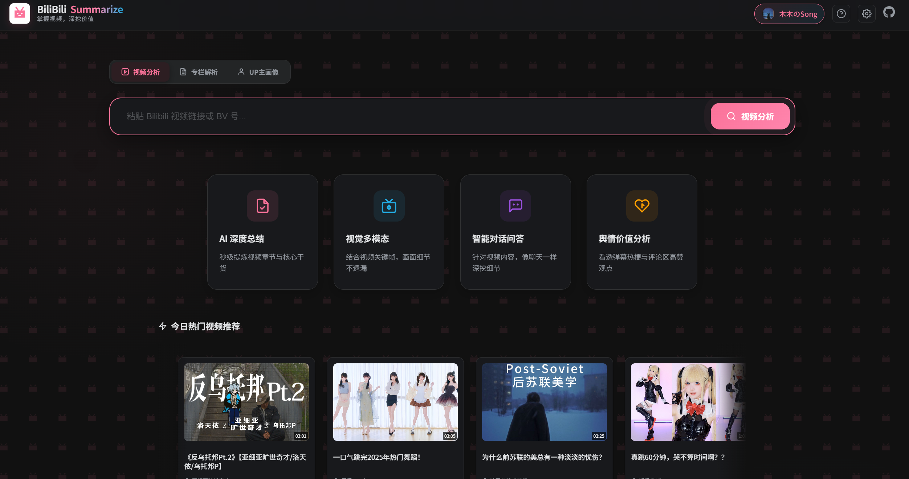
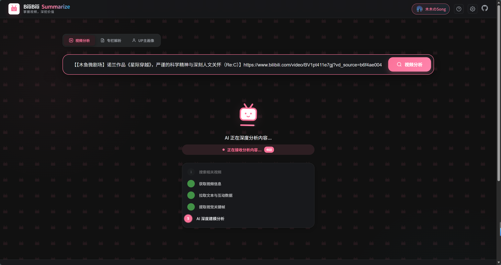
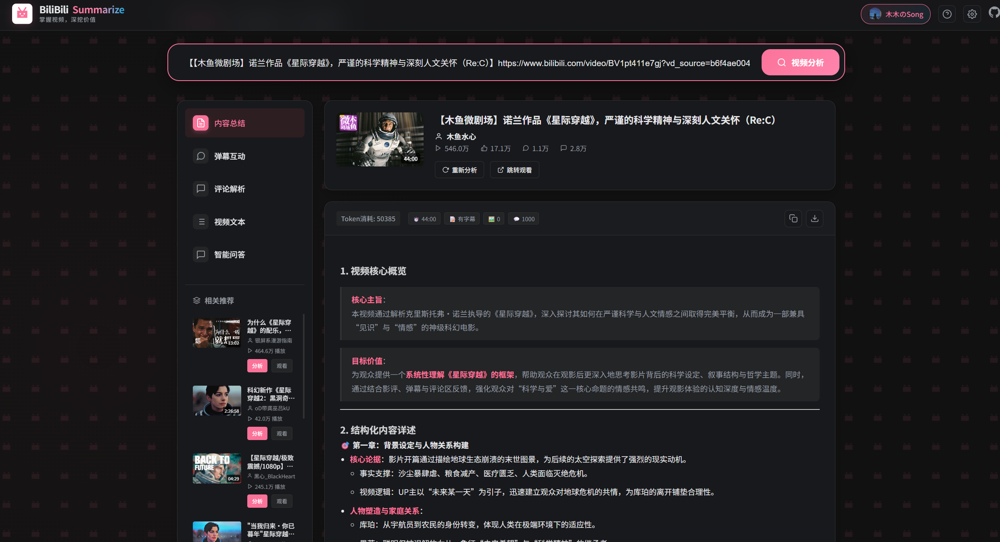
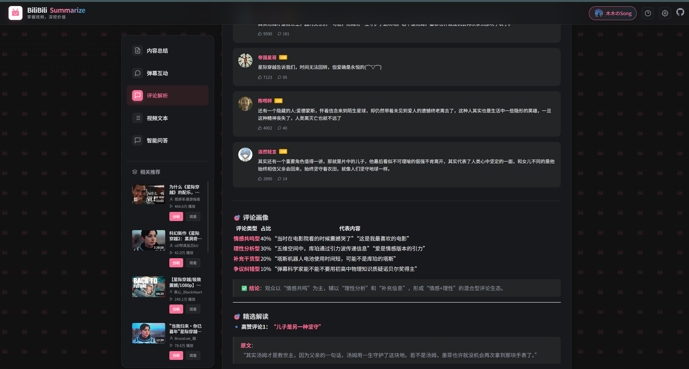
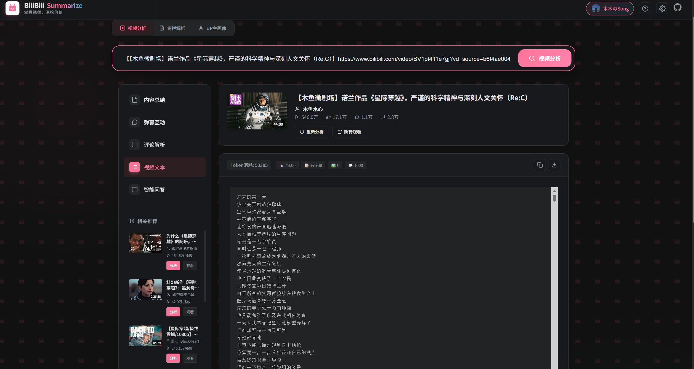
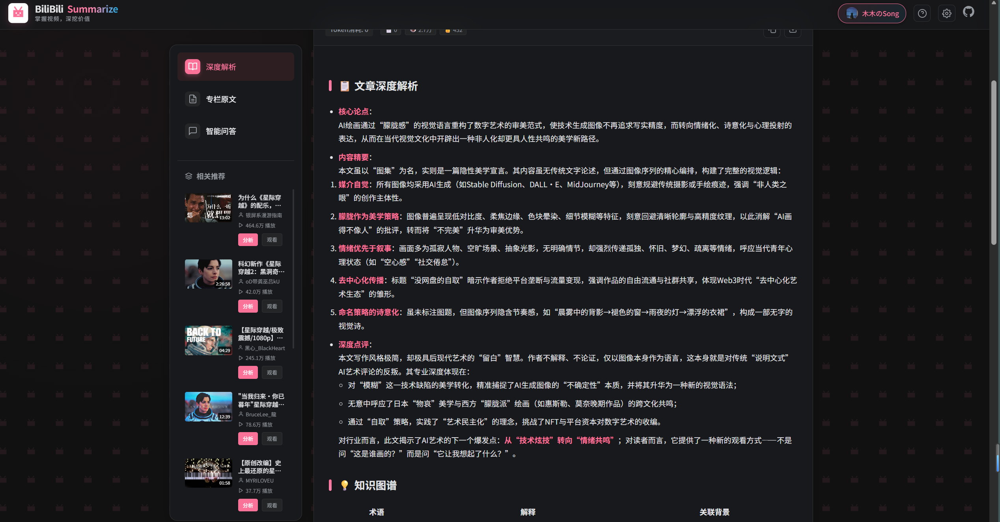
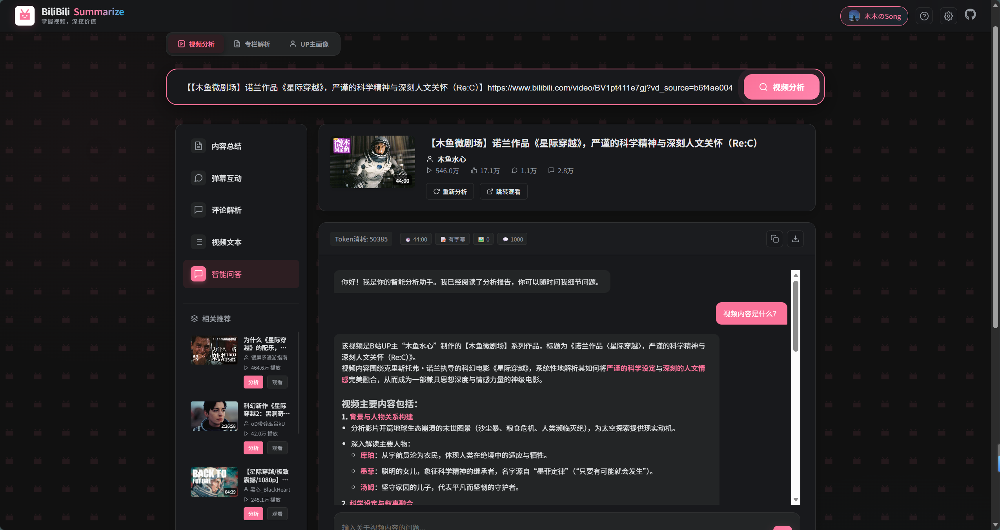
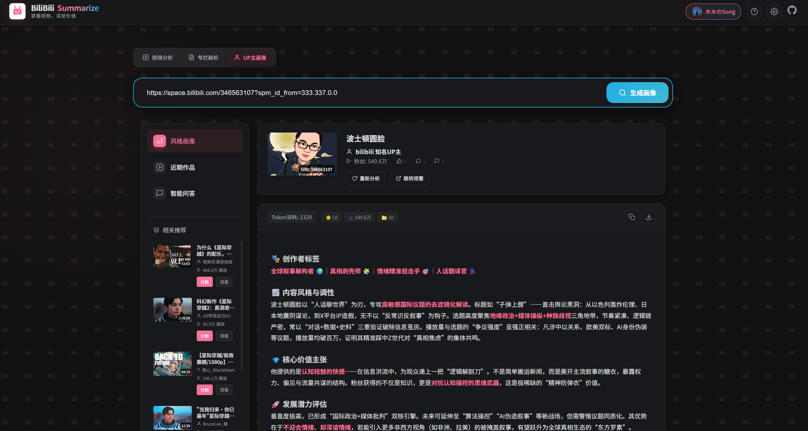

<div align="center">
  <h1>BiliBili Summarize | AI 動画高度分析アシスタント</h1>
  
  <h3>動画を掌握し、価値を深掘りする</h3>
</div>

**Bilibili 動画の字幕、弾幕、コメント、キーフレームを一クリックで抽出。AI マルチモーダルモデルを活用し、詳細な要約、マインドマップ、世論分析レポートを生成します。**

<div align="center">

[简体中文](README.md) | [English](README_EN.md) | [日本語](README_JP.md)

</div>

<div align="center">


[クイックスタート](#🚀-クイックスタート) • [機能特徴](#✨-機能特性) • [スクリーンショット](#🖼️-スクリーンショット) • [技術スタック](#🛠️-技術スタック) • [謝辞](#🙏-謝辞)

</div>

## ✨ 機能特性

- **📋 高度な内容要約**: 動画のチャプターと核心的な知識を数秒で要約。
- **🖼️ マルチモーダル視覚分析**: キーフレームを抽出し、視覚的な詳細をAIが解説。
- **💬 世論価値の深掘り**: 弾幕のトレンドやコメント欄の人気意見を徹底分析。
- **🤖 インテリジェントQ&A**: 動画の内容について、AIとチャット形式で深掘り質問。
- **📝 コラム & Opus 解析**: Bilibiliのコラム記事や「Opus」投稿の論理構造を解析。
- **🎭 UP主スタイル分析**: 直近の作品からクリエイターの調性や価値をプロファイリング。
- **🔐 Bilibili ログイン対応**: QRコードログインで、より高品質なデータ取得が可能。
- **🎨 モダンな芸術的 UI**: ダークモード対応の、美しくスムーズなレスポンシブデザイン。

## 🖼️ スクリーンショット

### 🏠 ホームプレビュー


### ⚙️ 分析プロセス


### 📊 詳細分析結果
| 動画要約 | 世論分析 |
| :---: | :---: |
|  |  |

| コメント分析 | 動画テキスト抽出 |
| :---: | :---: |
|  |  |

### 📝 コラム & ダイアログ
| Opus 解析 | AI ダイアログ |
| :---: | :---: |
|  |  |

### 🎭 UP主プロファイリング


## 🚀 クイックスタート

1. **依存関係のインストール**
   ```bash
   pip install -r requirements.txt
   ```

2. **環境設定**
   `.env.example` を `.env` にコピーし、APIキーを入力してください。
   または、起動後にUI右上の設定ボタンから設定可能です。

3. **アプリケーションの起動**
   ```bash
   uvicorn asgi:app --reload --host 0.0.0.0 --port 5001
   ```
   `http://localhost:5001` にアクセスして開始します。

## 🏗️ プロジェクト構造

```text
Bilibili_Analysis_Helper/
├── asgi.py             # FastAPI 起動エントリーポイント（推奨）
├── requirements.txt    # 依存ライブラリ
├── .env.example        # 環境変数テンプレート
├── README.md           # プロジェクトドキュメント
└── src/                # ソースコード
    ├── backend/        # 統一バックエンド（ドメイン + HTTP: src/backend/http）
    ├── frontend/       # フロントエンド（HTML, CSS, JS）
    └── config.py       # グローバル設定
```

## 🛠️ 技術スタック

- **バックエンド**: Python (FastAPI), `bilibili-api-python`, `aiohttp`
- **フロントエンド**: Vanilla HTML/JS/CSS3, `Marked.js` (Markdown レンダリング)
- **AI エンジン**: 全てのOpenAI互換マルチモーダルモデルに対応 (推奨：SiliconCloud, Qwen)

## 🙏 謝辞

- [bilibili-api-python](https://github.com/Nemo2011/bilibili-api) - 強力な Bilibili API ラッパー。
- [SiliconCloud](https://cloud.siliconflow.cn/) - 高速な演算リソースを提供。
- [LobeHub Icons](https://github.com/lobehub/lobe-icons) - 美しいアイコンセット。

---

## 💖 スポンサー & サポート

このプロジェクトが役に立った場合は、作者にコーヒーを一杯おごっていただけると嬉しいです ☕。皆様のサポートが継続的な開発の原動力になります！

<div align="center">


*寄付はこちら*

</div>

---

Created by [mumu_xsy](https://gitcode.com/mumu_xsy) | [リポジトリ](https://gitcode.com/mumu_xsy/Bilibili_Analysis_Helper)
