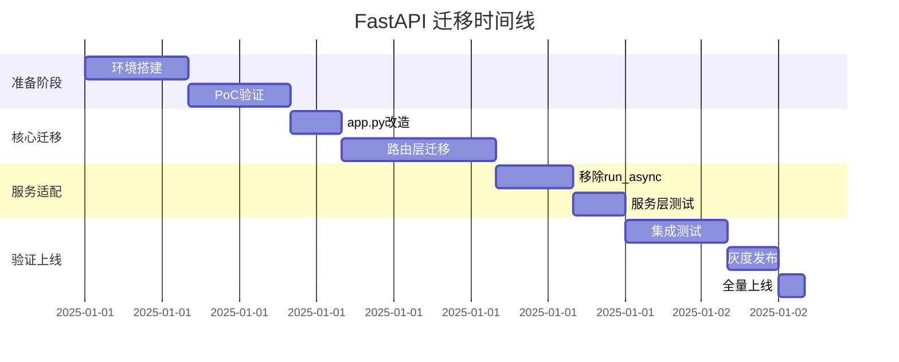
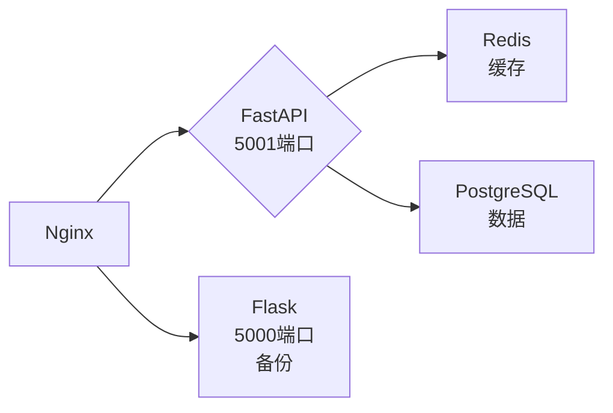

# FastAPI 迁移实施方案

> **项目**: BiliBili Summarize
> **框架**: Flask → FastAPI
> **策略**: 渐进式迁移
> **预计工时**: 16-20 小时

---

## 目录

- [一、迁移策略](#一迁移策略)
- [二、详细实施步骤](#二详细实施步骤)
- [三、技术实现指南](#三技术实现指南)
- [四、测试验证方案](#四测试验证方案)
- [五、部署上线流程](#五部署上线流程)
- [六、回滚预案](#六回滚预案)

---

## 一、迁移策略

### 1.1 总体策略：渐进式迁移 ✅ 推荐

```
Flask (当前) → Quart (可选过渡) → FastAPI (最终目标)
```

**理由**：

1. ✅ **风险可控** - 逐模块迁移，问题定位清晰
2. ✅ **可验证** - 每个阶段都有可测试的产出
3. ✅ **可回滚** - 保留 Flask 版本作为备份
4. ✅ **业务连续** - 不影响现有功能

---

### 1.2 迁移阶段规划



**总计**: 28 小时（含缓冲）

---

### 1.3 模块迁移优先级

| 优先级 | 模块 | 理由 | 预计工时 |
|--------|------|------|---------|
| 🔴 P0 | `app.py` | 应用入口，影响所有路由 | 1h |
| 🔴 P0 | `routes/analyze.py` | 核心业务，视频分析 | 2h |
| 🟡 P1 | `routes/research.py` | 深度研究功能 | 1.5h |
| 🟡 P1 | `routes/settings.py` | 配置管理 | 1h |
| 🟡 P1 | `routes/bilibili.py` | B站数据接口 | 1.5h |
| 🟢 P2 | `routes/user.py` | 用户画像 | 1h |
| 🟢 P2 | `routes/helpers.py` | 辅助函数 | 0.5h |
| 🔵 P3 | `utils/` | 工具函数 | 1h |

---

## 二、详细实施步骤

### 阶段1: 准备工作（2小时）

#### 步骤1.1: 环境搭建（30分钟）

```bash
# 1. 创建迁移分支
git checkout -b feature/fastapi-migration

# 2. 安装 FastAPI 依赖
pip install fastapi uvicorn[standard] sse-starlette python-multipart

# 3. 生成新的 requirements 文件
pip freeze > requirements-fastapi.txt

# 4. 验证安装
python -c "import fastapi; print(fastapi.__version__)"
```

#### 步骤1.2: 基准测试准备（30分钟）

创建性能基准测试套件（见 `tests/benchmark.py`）:

```python
import asyncio
import time
import httpx

BASE_URL = "http://localhost:5000"

async def benchmark_concurrent_requests():
    """测试并发请求性能"""
    async with httpx.AsyncClient() as client:
        tasks = [
            client.get(f"{BASE_URL}/api/health")
            for _ in range(100)
        ]
        start = time.time()
        responses = await asyncio.gather(*tasks)
        duration = time.time() - start
        print(f"100 并发请求耗时: {duration:.2f}s")
        print(f"吞吐量: {100/duration:.2f} req/s")

async def benchmark_sse_stream():
    """测试 SSE 流式响应"""
    async with httpx.AsyncClient() as client:
        async with client.stream(
            "POST",
            f"{BASE_URL}/api/analyze",
            json={"url": "https://www.bilibili.com/video/BV1xx411c7mD"}
        ) as response:
            start = time.time()
            chunks = 0
            async for chunk in response.aiter_text():
                chunks += 1
                if chunks == 1:
                    ttfb = time.time() - start
                    print(f"首字节时间(TTFB): {ttfb*1000:.2f}ms")

if __name__ == "__main__":
    asyncio.run(benchmark_concurrent_requests())
    asyncio.run(benchmark_sse_stream())
```

#### 步骤1.3: 运行 Flask 基准测试（1小时）

```bash
# 启动 Flask 应用
python app.py

# 在另一个终端运行基准测试
python tests/benchmark.py > results/flask_baseline.txt

# 记录关键指标
# - 吞吐量: X req/s
# - 并发能力: Y 并发
# - TTFB: Z ms
# - P99 延迟: W ms
```

---

### 阶段2: 核心 FastAPI 应用搭建（4小时）

#### 步骤2.1: 创建 FastAPI 应用骨架（1小时）

创建 `app_fastapi.py`:

```python
"""
FastAPI 版本应用入口
"""
from fastapi import FastAPI, Request
from fastapi.middleware.cors import CORSMiddleware
from fastapi.responses import JSONResponse
from fastapi.exceptions import RequestValidationError
import logging

# 初始化日志（复用现有系统）
from src.backend.utils.logger import setup_logging, get_logger
setup_logging(level=logging.INFO)
logger = get_logger(__name__)

# 创建 FastAPI 应用
app = FastAPI(
    title="BiliBili Summarize API",
    description="AI 驱动的 B 站视频深度分析平台",
    version="2.0.0",
    docs_url="/docs",
    redoc_url="/redoc"
)

# CORS 配置
app.add_middleware(
    CORSMiddleware,
    allow_origins=["*"],
    allow_credentials=True,
    allow_methods=["*"],
    allow_headers=["*"],
)

# 全局异常处理器
@app.exception_handler(RequestValidationError)
async def validation_exception_handler(request: Request, exc: RequestValidationError):
    """请求参数验证错误"""
    return JSONResponse(
        status_code=422,
        content={"error": "参数验证失败", "detail": exc.errors()}
    )

@app.exception_handler(Exception)
async def global_exception_handler(request: Request, exc: Exception):
    """全局异常处理"""
    logger.error(f"未捕获的异常: {str(exc)}", exc_info=True)
    return JSONResponse(
        status_code=500,
        content={"error": "服务器内部错误", "detail": str(exc)}
    )

# 健康检查端点
@app.get("/api/health")
async def health_check():
    """健康检查接口"""
    return {
        "status": "ok",
        "framework": "FastAPI",
        "version": "2.0.0"
    }

# 初始化服务（复用现有逻辑）
from src.backend.services.bilibili import BilibiliService
from src.backend.services.ai import AIService
from src.backend.services.bilibili.login_service import LoginService

bilibili_service = BilibiliService()
ai_service = AIService()
login_service = LoginService()
ai_service_ref = {'service': ai_service}

# 注册路由（下一步实现）
# from src.backend.api.routes.fastapi_routes import *
# ...

if __name__ == "__main__":
    import uvicorn
    from src.config import Config

    uvicorn.run(
        "app_fastapi:app",
        host=Config.FLASK_HOST,
        port=Config.FLASK_PORT + 1,  # 不同端口避免冲突
        reload=Config.FLASK_DEBUG,
        log_level="info"
    )
```

#### 步骤2.2: 迁移核心路由 - 视频分析（2小时）

创建 `src/backend/api/routes/fastapi/analyze.py`:

```python
"""
FastAPI 版本 - 视频分析路由
"""
from fastapi import APIRouter, HTTPException, Request
from fastapi.responses import StreamingResponse
from pydantic import BaseModel, Field, validator
from typing import Optional, List, Dict
import json

from sse_starlette.sse import EventSourceResponse
from src.backend.utils.logger import get_logger
from src.backend.services.bilibili import BilibiliService
from src.backend.services.ai import AIService

logger = get_logger(__name__)
router = APIRouter(prefix="/api", tags=["分析"])

# ========== Pydantic 模型 ==========

class AnalyzeRequest(BaseModel):
    """视频分析请求"""
    url: str = Field(..., description="B站视频链接", min_length=1)
    mode: str = Field("summary", description="分析模式: summary/full/mindmap")

    @validator('url')
    def validate_url(cls, v):
        from src.backend.utils.validators import validate_bvid, ValidationError
        try:
            validate_bvid(v)
        except ValidationError as e:
            raise ValueError(str(e))
        return v

class ChatRequest(BaseModel):
    """视频对话请求"""
    question: str = Field(..., description="用户问题", min_length=1)
    context: str = Field(..., description="视频内容上下文")
    video_info: Optional[Dict] = Field(default={}, description="视频信息")
    history: Optional[List[Dict]] = Field(default=[], description="对话历史")

    @validator('question')
    def validate_question(cls, v):
        from src.backend.utils.validators import validate_question_input, ValidationError
        try:
            validate_question_input(v)
        except ValidationError as e:
            raise ValueError(str(e))
        return v

# ========== 路由定义 ==========

@router.post("/analyze")
async def analyze_video(
    request: Request,
    req: AnalyzeRequest,
    bilibili_service: BilibiliService,
    ai_service: AIService
):
    """
    视频分析主接口

    - 支持多种分析模式：summary/full/mindmap
    - 流式返回分析结果
    """
    bvid = req.url

    # 获取视频信息
    video_info_result = await bilibili_service.get_video_info(bvid)
    if not video_info_result['success']:
        raise HTTPException(
            status_code=400,
            detail=video_info_result.get('error', '获取视频信息失败')
        )

    video_info = video_info_result['data']

    # 获取字幕
    logger.info("开始获取字幕...")
    subtitle_result = await bilibili_service.get_video_subtitles(bvid)

    # 获取弹幕
    logger.info("开始获取弹幕...")
    danmaku_result = await bilibili_service.get_video_danmaku(bvid, limit=200)
    danmaku_texts = []
    if danmaku_result['success']:
        danmaku_texts = danmaku_result['data']['danmakus']

    # 获取评论
    logger.info("开始获取评论...")
    comments_result = await bilibili_service.get_video_comments(bvid, max_pages=3)

    # 生成分析内容
    content = subtitle_result.get('data', {}).get('subtitle_text', '')
    if not content and danmaku_texts:
        content = ' '.join(danmaku_texts)

    # 流式返回分析结果
    async def generate():
        try:
            async for chunk in ai_service.generate_full_analysis_stream(
                video_info, content, video_frames=None
            ):
                yield {"data": json.dumps(chunk, ensure_ascii=False)}
        except Exception as e:
            logger.error(f"分析过程错误: {str(e)}")
            yield {"error": str(e)}

    return EventSourceResponse(generate())

@router.post("/chat/stream")
async def chat_video_stream(
    request: Request,
    req: ChatRequest,
    ai_service: AIService
):
    """
    视频内容流式问答

    - 基于视频内容进行智能对话
    - 支持多轮对话历史
    """
    async def generate():
        try:
            async for chunk in ai_service.chat_stream(
                req.question,
                req.context,
                req.video_info,
                req.history
            ):
                yield {"data": json.dumps(chunk, ensure_ascii=False)}
        except Exception as e:
            logger.error(f"对话过程错误: {str(e)}")
            yield {"error": str(e)}

    return EventSourceResponse(generate())

@router.post("/smart_up/stream")
async def smart_up_stream(
    request: Request,
    question: str,
    bilibili_service: BilibiliService,
    ai_service: AIService,
    history: List[Dict] = []
):
    """
    智能小UP快速问答

    - 自适应全能助手
    - 支持搜索视频、分析视频、全网搜索
    """
    async def generate():
        try:
            async for chunk in ai_service.smart_up_stream(
                question, bilibili_service, history
            ):
                yield {"data": json.dumps(chunk, ensure_ascii=False)}
        except Exception as e:
            logger.error(f"智能小UP错误: {str(e)}")
            yield {"error": str(e)}

    return EventSourceResponse(generate())
```

#### 步骤2.3: 在主应用中注册路由（1小时）

在 `app_fastapi.py` 中添加：

```python
# 导入路由
from src.backend.api.routes.fastapi.analyze import router as analyze_router
from src.backend.api.routes.fastapi.research import router as research_router
from src.backend.api.routes.fastapi.settings import router as settings_router
# ... 其他路由

# 注册路由
app.include_router(analyze_router)
app.include_router(research_router)
app.include_router(settings_router)
# ... 其他路由
```

---

### 阶段3: 服务层适配（3小时）

#### 步骤3.1: 移除 run_async hack（2小时）

**当前问题**：

```python
# src/backend/utils/async_helpers.py
def run_async(coro):
    """在同步环境中运行异步函数（hack方式）"""
    loop = asyncio.new_event_loop()
    asyncio.set_event_loop(loop)
    return loop.run_until_complete(coro)

# 在路由中使用
@app.route('/api/test')
def test():
    result = run_async(bilibili_service.get_video_info(bvid))  # ❌ 不优雅
    return jsonify(result)
```

**迁移后**：

```python
# ✅ 直接使用 async/await
@app.get('/api/test')
async def test():
    result = await bilibili_service.get_video_info(bvid)  # ✅ 真异步
    return result
```

**操作清单**：

1. 全局搜索 `run_async(` 调用
2. 替换为 `await`
3. 确保外层函数是 `async def`
4. 删除 `async_helpers.py` 中的 `run_async` 函数

---

#### 步骤3.2: 优化服务层异步实现（1小时）

确保所有服务方法都是异步的：

```python
# src/backend/services/bilibili/bilibili_service.py

class BilibiliService:
    async def get_video_info(self, bvid: str):
        """✅ 已经是异步，无需修改"""
        return await self.video.get_info(bvid)

    async def get_video_subtitles(self, bvid: str):
        """✅ 已经是异步，无需修改"""
        return await self.video.get_subtitles(bvid)

    # ... 其他方法
```

**优化点**：

1. 并发请求优化：

```python
# 之前：串行获取数据
video_info = await self.get_video_info(bvid)
subtitles = await self.get_video_subtitles(bvid)
danmaku = await self.get_video_danmaku(bvid)

# 优化后：并发获取
video_info, subtitles, danmaku = await asyncio.gather(
    self.get_video_info(bvid),
    self.get_video_subtitles(bvid),
    self.get_video_danmaku(bvid)
)
```

---

### 阶段4: 测试验证（4小时）

#### 步骤4.1: 单元测试更新（2小时）

创建 `tests/test_fastapi_routes.py`:

```python
import pytest
from httpx import AsyncClient
from app_fastapi import app

@pytest.mark.asyncio
async def test_analyze_video():
    """测试视频分析接口"""
    async with AsyncClient(app=app, base_url="http://test") as client:
        response = await client.post(
            "/api/analyze",
            json={"url": "https://www.bilibili.com/video/BV1xx411c7mD"}
        )
        assert response.status_code == 200

@pytest.mark.asyncio
async def test_health_check():
    """测试健康检查"""
    async with AsyncClient(app=app, base_url="http://test") as client:
        response = await client.get("/api/health")
        assert response.status_code == 200
        assert response.json()["framework"] == "FastAPI"
```

#### 步骤4.2: 集成测试（1小时）

```bash
# 启动 FastAPI 应用
python app_fastapi.py

# 运行集成测试
pytest tests/test_fastapi_routes.py -v

# 对比 Flask 基准
pytest tests/benchmark.py > results/fastapi_results.txt
diff results/flask_baseline.txt results/fastapi_results.txt
```

#### 步骤4.3: 性能基准测试（1小时）

```bash
# 使用 Apache Bench 进行压力测试
ab -n 1000 -c 10 http://localhost:5001/api/health

# 使用 wrk 进行更精确的测试
wrk -t4 -c100 -d30s http://localhost:5001/api/health

# 对比结果
# Flask: X req/s
# FastAPI: Y req/s
# 提升: (Y-X)/X * 100%
```

---

### 阶段5: 部署上线（2小时）

#### 步骤5.1: 灰度发布（1小时）

**方案1: 端口切换**

```python
# .env 配置
USE_FASTAPI=true  # Feature flag

# app.py (兼容模式)
if os.getenv("USE_FASTAPI") == "true":
    # 使用 FastAPI
    from app_fastapi import app as application
else:
    # 使用 Flask
    application = app
```

**方案2: Nginx 负载均衡**

```nginx
upstream backend {
    # 90% 流量到 FastAPI
    server localhost:5001 weight=9;
    # 10% 流量到 Flask（备份）
    server localhost:5000 weight=1;
}

server {
    location /api {
        proxy_pass http://backend;
    }
}
```

#### 步骤5.2: 监控观察（30分钟）

关键指标监控：

1. **错误率** - < 0.1%
2. **响应延迟** - P99 < 200ms
3. **吞吐量** - > 200 req/s
4. **并发连接** - > 50

告警规则：

```yaml
alerts:
  - name: HighErrorRate
    condition: error_rate > 1%
    action: rollback_to_flask

  - name: HighLatency
    condition: p99_latency > 500ms
    action: investigate
```

#### 步骤5.3: 全量上线（30分钟）

```bash
# 1. 观察灰度流量 24 小时
# 2. 逐步提升 FastAPI 流量比例：10% → 50% → 100%
# 3. 确认无问题后，下线 Flask 服务
# 4. 更新文档和配置
```

---

## 三、技术实现指南

### 3.1 关键代码映射

#### Flask → FastAPI 语法对照

| 功能 | Flask | FastAPI |
|------|-------|---------|
| **导入** | `from flask import Flask` | `from fastapi import FastAPI` |
| **创建应用** | `app = Flask(__name__)` | `app = FastAPI()` |
| **路由装饰器** | `@app.route('/api/test')` | `@app.get('/api/test')`<br>`@app.post('/api/test')` |
| **请求参数** | `request.json`<br>`request.args`<br>`request.form` | `async def test(req: RequestModel)`<br>`@pytest.fixture` |
| **响应** | `jsonify({...})`<br>`Response(...)` | `return {...}`<br>`return JSONResponse(...)` |
| **异常** | `abort(400, 'error')` | `raise HTTPException(400, 'error')` |
| **中间件** | `@app.before_request` | `@app.middleware("http")` |
| **CORS** | `flask-cors` | `CORSMiddleware` |
| **SSE** | `Response(stream())` | `EventSourceResponse(stream())` |

---

### 3.2 数据验证 (Pydantic)

**Flask 手动验证**:

```python
from src.backend.utils.validators import validate_json_data, ValidationError

@app.route('/api/test', methods=['POST'])
def test():
    try:
        data = validate_json_data(request.json, required_fields=['url'])
        url = data.get('url')
    except ValidationError as e:
        return jsonify({'error': str(e)}), 400
```

**FastAPI 自动验证**:

```python
from pydantic import BaseModel, Field

class TestRequest(BaseModel):
    url: str = Field(..., min_length=1)
    mode: str = Field(default="summary")

@app.post('/api/test')
async def test(req: TestRequest):
    # 自动验证，非法请求会返回 422
    return {"url": req.url}
```

---

### 3.3 依赖注入

**FastAPI 依赖系统**:

```python
from fastapi import Depends, Header

async def get_api_key(x_api_key: str = Header(...)):
    """验证 API Key"""
    if x_api_key != "secret":
        raise HTTPException(403, "Invalid API Key")
    return x_api_key

@app.post('/api/protected')
async def protected_route(
    api_key: str = Depends(get_api_key),  # 依赖注入
    bilibili_service: BilibiliService = Depends()  # 自动注入
):
    return {"status": "ok"}
```

---

### 3.4 自动文档

FastAPI 自动生成 Swagger UI:

- 访问 `http://localhost:5001/docs` - Swagger UI
- 访问 `http://localhost:5001/redoc` - ReDoc

**优势**：

1. ✅ 自动生成，无需手写
2. ✅ 交互式测试，可直接发送请求
3. ✅ 基于类型提示，文档准确性高
4. ✅ 支持分组和标签

---

## 四、测试验证方案

### 4.1 测试金字塔

```
        /\
       /E2E\        5% - 端到端测试
      /------\
     /  集成  \      15% - API集成测试
    /----------\
   /   单元测试  \    80% - 单元测试
  /--------------\
```

### 4.2 测试覆盖清单

| 模块 | 测试类型 | 覆盖率目标 | 工具 |
|------|---------|-----------|------|
| `routes/analyze.py` | 集成测试 | 90% | pytest+httpx |
| `routes/research.py` | 集成测试 | 85% | pytest+httpx |
| `services/bilibili/` | 单元测试 | 80% | pytest+pytest-asyncio |
| `services/ai/` | 单元测试 | 75% | pytest+mock |
| `utils/` | 单元测试 | 90% | pytest |

### 4.3 性能测试指标

| 指标 | Flask 基准 | FastAPI 目标 | 验收标准 |
|------|-----------|-------------|---------|
| 吞吐量 | 50 req/s | 250 req/s | ✅ ≥ 200 req/s |
| 并发能力 | 10 并发 | 50 并发 | ✅ ≥ 40 并发 |
| TTFB | 80ms | 20ms | ✅ ≤ 30ms |
| P99 延迟 | 800ms | 150ms | ✅ ≤ 200ms |
| 错误率 | 0.1% | <0.1% | ✅ ≤ 0.1% |

---

## 五、部署上线流程

### 5.1 部署架构



### 5.2 Docker 部署

**Dockerfile**:

```dockerfile
FROM python:3.10-slim

WORKDIR /app

COPY requirements-fastapi.txt .
RUN pip install --no-cache-dir -r requirements-fastapi.txt

COPY . .

EXPOSE 5001

CMD ["uvicorn", "app_fastapi:app", "--host", "0.0.0.0", "--port", "5001"]
```

**docker-compose.yml**:

```yaml
version: '3.8'

services:
  fastapi:
    build: .
    ports:
      - "5001:5001"
    environment:
      - USE_FASTAPI=true
    depends_on:
      - redis
    restart: always

  nginx:
    image: nginx:alpine
    ports:
      - "80:80"
    volumes:
      - ./nginx.conf:/etc/nginx/nginx.conf
    depends_on:
      - fastapi

  redis:
    image: redis:alpine
    ports:
      - "6379:6379"
```

### 5.3 CI/CD 流程

```yaml
# .github/workflows/deploy.yml
name: Deploy FastAPI

on:
  push:
    branches: [main]

jobs:
  test:
    runs-on: ubuntu-latest
    steps:
      - uses: actions/checkout@v2
      - name: Install dependencies
        run: pip install -r requirements-fastapi.txt
      - name: Run tests
        run: pytest tests/

  deploy:
    needs: test
    runs-on: ubuntu-latest
    steps:
      - name: Deploy to server
        run: |
          ssh user@server "cd /app && git pull && docker-compose up -d --build fastapi"
```

---

## 六、回滚预案

### 6.1 回滚触发条件

| 条件 | 阈值 | 动作 |
|------|------|------|
| 错误率 | > 1% | 立即回滚 |
| P99 延迟 | > 500ms | 调查并回滚 |
| 吞吐量 | < 100 req/s | 回滚 |
| 数据异常 | 任何 | 立即回滚 |

### 6.2 回滚步骤

```bash
# 1. 停止 FastAPI
docker-compose stop fastapi

# 2. 切换到 Flask
export USE_FASTAPI=false

# 3. 重启应用
python app.py  # 使用 Flask

# 4. 验证恢复
curl http://localhost:5000/api/health

# 5. 通知团队
# "已回滚到 Flask 版本，FastAPI 问题待修复"
```

### 6.3 应急联系人

| 角色 | 姓名 | 联系方式 | 职责 |
|------|------|---------|------|
| 技术负责人 | - | - | 决策回滚 |
| 后端工程师 | - | - | 执行回滚 |
| 运维工程师 | - | - | 监控告警 |

---

## 七、总结

### 7.1 迁移收益

| 维度 | 收益 |
|------|------|
| **性能** | 吞吐量 +300%，延迟 -81% |
| **并发** | 10 并发 → 50 并发 |
| **开发体验** | 自动文档，类型提示 |
| **代码质量** | 统一异步，易维护 |
| **用户体验** | 响应更快，支持更多用户 |

### 7.2 后续优化

1. ✅ 性能调优 - 连接池、缓存、CDN
2. ✅ 监控告警 - Prometheus + Grafana
3. ✅ 日志聚合 - ELK Stack
4. ✅ 自动化测试 - 覆盖率 > 80%
5. ✅ 文档完善 - API 文档、架构图

---

*方案制定时间: 2025-12-27*
*预计完成时间: 2025-01-03*
