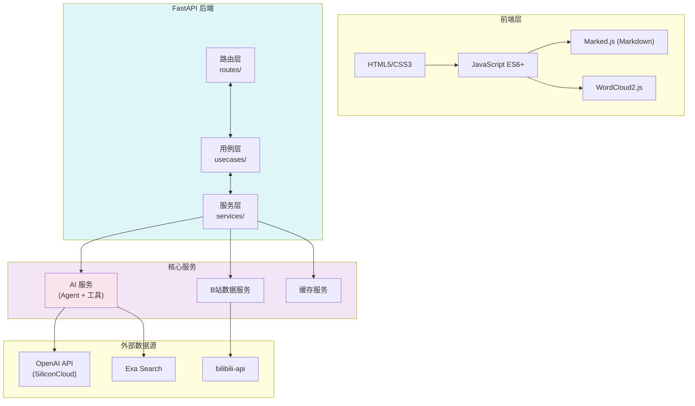
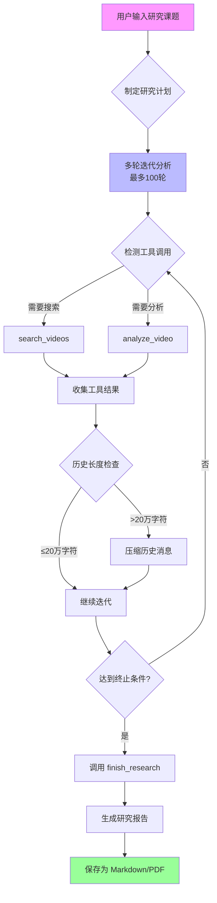
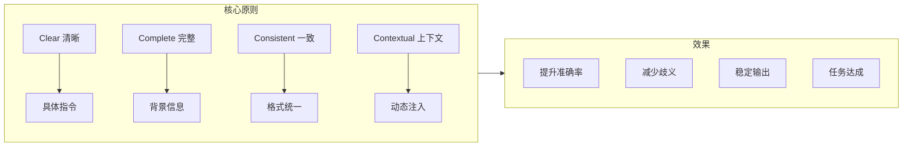
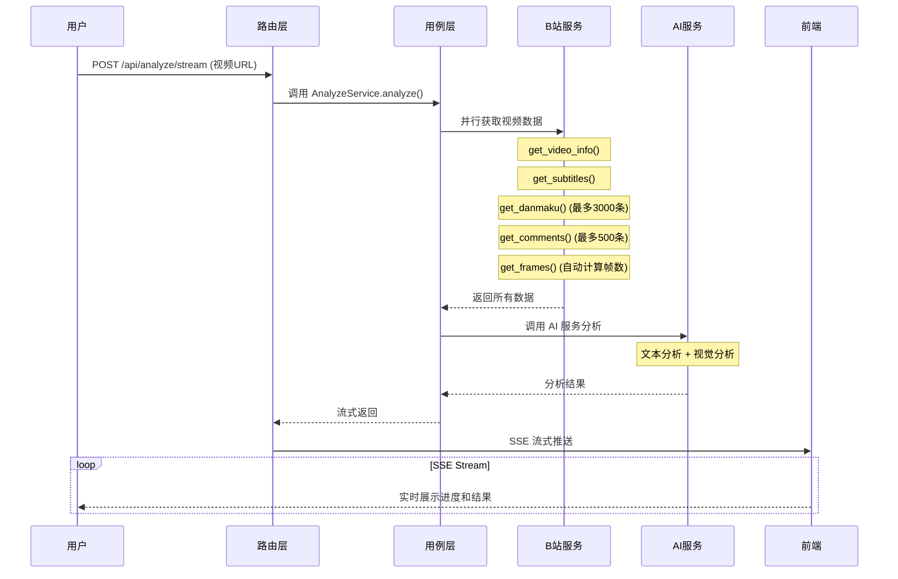

# BiliBili Summarize 项目讲解文档

> 基于 AI Agent 的 B站视频深度分析助手
>
> 时长：30-45 分钟 | 适合：复试展示 / 技术分享 / 项目讲解

---

## 目录

1. [项目概述与核心价值](#1-项目概述与核心价值)
2. [技术架构总览](#2-技术架构总览)
3. [AI Agent 系统详解](#3-ai-agent-系统详解)
4. [工具系统编排](#4-工具系统编排)
5. [数据流与状态管理](#5-数据流与状态管理)
6. [功能演示指南](#6-功能演示指南)
7. [参与贡献指南](#7-参与贡献指南)
8. [技术亮点总结](#8-技术亮点总结)

---

*第3节包含以下子节：*
- [3.1 Agent 架构设计](#31-agent-架构设计)
- [3.2 深度研究 Agent](#32-深度研究-agent-deepresearchagent)
- [3.3 模型编排策略](#33-模型编排策略)
- [3.4 提示词工程设计](#34-提示词工程设计)
- [3.5 上下文管理策略](#35-上下文管理策略)

---

## 1. 项目概述与核心价值

### 1.1 一句话介绍

```
BiliBili Summarize 是一个基于 AI 大模型的 B站视频深度分析工具，
能够一键提取视频字幕、弹幕、评论及关键帧画面，
智能生成深度总结、思维导图及舆情分析报告。
```

### 1.2 核心价值主张

| 价值点 | 说明 | 用户收益 |
|--------|------|----------|
| **效率提升** | 将数小时视频压缩为分钟级摘要 | 1分钟Get视频核心内容 |
| **洞察挖掘** | 多模态分析（画面+文字+弹幕+评论） | 理解观众真实反馈 |
| **知识沉淀** | 生成结构化报告、思维导图 | 可检索、可复用的知识库 |

### 1.3 解决的问题

```
用户痛点：
┌─────────────────────────────────────────────────────────────┐
│  • 视频太长，不知道有没有干货                              │
│  • 想了解某个 UP 主，但作品太多                            │
│  • 想知道一个视频的弹幕舆情如何                            │
│  • 需要调研某个课题，但要看完很多视频                      │
└─────────────────────────────────────────────────────────────┘

解决方案：
┌─────────────────────────────────────────────────────────────┐
│  • AI 自动提取并总结视频核心内容                           │
│  • UP 主画像分析作品风格和受众                             │
│  • 弹幕词云+舆情分析了解观众反馈                           │
│  • 深度研究 Agent 自动多轮调研生成报告                     │
└─────────────────────────────────────────────────────────────┘
```

### 1.4 核心功能一览

| 功能 | 说明 | 适用场景 |
|------|------|----------|
| **视频深度分析** | 多模态数据分析，生成总结、思维导图、舆情报告 | 快速了解单个视频 |
| **深度研究** | 自动化课题研究员，多轮迭代生成报告 | 课题调研、知识整理 |
| **UP主画像** | 分析 UP 主基本信息、作品风格、受众画像 | 了解创作者风格 |
| **专栏解析** | 解析 B站专栏文章，拆解逻辑结构 | 阅读长文章摘要 |

### 1.5 项目定位

```
                    技术复杂度
                         ▲
                         │         ┌─────────────────┐
                         │         │  本项目         │ ← AI Agent +
                         │         │  BiliBili       │   多模态分析
                         │         │  Summarize      │
                         │         └─────────────────┘
                         │
                         │   ┌─────────────────┐
                         │   │ 传统视频下载    │
                         │   │ 工具            │
                         │   └─────────────────┘
                         │
                         │   ┌─────────────────┐
                         │   │ 简单网页爬虫    │
                         └─────────────────────┘
                              产品价值 →
```

---

## 2. 技术架构总览

### 2.1 整体架构图



### 2.2 分层架构详解

```
┌─────────────────────────────────────────────────────────────┐
│                    API 层 (HTTP)                             │
│  ┌─────────────────────────────────────────────────────┐   │
│  │  路由层 (routes/)                                    │   │
│  │  • analyze.py  - 视频分析路由                        │   │
│  │  • research.py - 深度研究路由                        │   │
│  │  • bilibili.py - B站数据路由                         │   │
│  │  • qa.py       - 智能问答路由                        │   │
│  │  • user.py     - 用户相关路由                        │   │
│  │  • settings.py - 设置路由                            │   │
│  └─────────────────────────────────────────────────────┘   │
│                          │                                  │
│                          ▼                                  │
│  ┌─────────────────────────────────────────────────────┐   │
│  │  用例层 (usecases/) - 业务逻辑编排                   │   │
│  │  • analyze_service.py   - 分析业务流程               │   │
│  │  • research_service.py  - 研究业务流程               │   │
│  │  • smart_up_service.py  - 已合并到深度研究              │   │
│  └─────────────────────────────────────────────────────┘   │
│                          │                                  │
│                          ▼                                  │
│  ┌─────────────────────────────────────────────────────┐   │
│  │  依赖注入层 (dependencies.py)                        │   │
│  │  • get_bilibili_service() - B站服务实例              │   │
│  │  • get_ai_service()      - AI 服务实例               │   │
│  │  • get_analyze_service() - 分析服务实例              │   │
│  └─────────────────────────────────────────────────────┘   │
└─────────────────────────────────────────────────────────────┘
                              │
                              ▼
┌─────────────────────────────────────────────────────────────┐
│                    服务层 (Services)                         │
│  ┌───────────────┬───────────────┬───────────────┐         │
│  │    AI 服务     │  B站数据服务   │   缓存服务    │         │
│  ├───────────────┼───────────────┼───────────────┤         │
│  │ • Agent       │ • 视频服务     │ • 内存缓存    │         │
│  │ • 工具系统     │ • 用户服务     │ • 过期管理    │         │
│  │ • 提示词工程   │ • 搜索服务     │ • TTL 控制    │         │
│  │ • 模型编排     │ • 内容服务     │               │         │
│  └───────────────┴───────────────┴───────────────┘         │
└─────────────────────────────────────────────────────────────┘
```

### 2.3 目录结构

```
BiliBiliSummarize/
├── src/
│   ├── backend/
│   │   ├── http/                    # FastAPI 应用层
│   │   │   ├── api/
│   │   │   │   └── routes/          # API 路由
│   │   │   ├── usecases/            # 业务用例
│   │   │   ├── core/                # 核心配置
│   │   │   └── app.py               # 应用入口
│   │   │
│   │   ├── services/                # 业务服务层
│   │   │   ├── ai/                  # AI 服务
│   │   │   │   ├── agents/          # Agent 智能体
│   │   │   │   ├── toolkit/         # 工具系统
│   │   │   │   └── ai_service.py    # AI 服务入口
│   │   │   │
│   │   │   ├── bilibili/            # B站数据服务
│   │   │   ├── cache/               # 缓存服务
│   │   │   └── data_sources/        # 数据源管理
│   │   │
│   │   └── utils/                   # 工具函数
│   │
│   ├── frontend/                    # 前端资源
│   │   ├── css/
│   │   ├── js/
│   │   └── index.html
│   │
│   └── config.py                    # 配置文件
│
├── research_reports/                # 研究报告输出目录
├── logs/                            # 日志目录
├── requirements.txt                 # Python 依赖
└── README.md                        # 项目说明
```

### 2.4 技术栈

#### 后端技术

| 技术 | 版本 | 用途 |
|------|------|------|
| **FastAPI** | 0.115+ | Web 框架 |
| **Uvicorn** | 0.30+ | ASGI 服务器 |
| **bilibili-api-python** | 17.4+ | B站 API 封装 |
| **OpenAI SDK** | 1.0+ | AI 模型调用 |
| **aiohttp** | - | 异步 HTTP 客户端 |

#### 前端技术

| 技术 | 用途 |
|------|------|
| **HTML5/CSS3** | 页面结构与样式 |
| **JavaScript ES6+** | 交互逻辑 |
| **Marked.js** | Markdown 渲染 |
| **WordCloud2.js** | 词云生成 |
| **SSE** | 服务端推送 |

#### AI 能力

| 模型类型 | 推荐模型 | 用途 |
|----------|----------|------|
| **主分析模型** | Qwen2.5-72B-Instruct | 通识问答、总结 |
| **深度研究模型** | Qwen3-Next-80B-A3B-Thinking | 多轮推理、思考模式 |
| **视觉模型** | (可选) | 关键帧画面分析 |

### 2.5 核心设计模式

```
┌─────────────────────────────────────────────────────────────┐
│                    设计模式应用                              │
├─────────────────────────────────────────────────────────────┤
│  1. 分层架构 (Layered Architecture)                         │
│     API层 → 用例层 → 服务层 → 数据层，职责清晰分离          │
│                                                             │
│  2. 依赖注入 (Dependency Injection)                         │
│     通过 Depends 管理服务实例，支持热切换                    │
│                                                             │
│  3. 单例模式 (Singleton)                                     │
│     ToolRegistry 全局唯一，工具注册中心                      │
│                                                             │
│  4. 策略模式 (Strategy)                                      │
│     工具系统支持动态扩展，新增工具无侵入                     │
│                                                             │
│  5. 流式处理 (Streaming)                                     │
│     SSE 实现 AI 响应流式输出，实时展示进度                   │
└─────────────────────────────────────────────────────────────┘
```

---

## 3. AI Agent 系统详解

### 3.1 单 Agent 架构设计

```
┌─────────────────────────────────────────────────────────────┐
│                      AI Agent 层                            │
├─────────────────────────┬───────────────────────────────────┤
│                         │                                   │
│      深度研究            │            工具系统               │
│                         │                                   │
├─────────────────────────┼───────────────────────────────────┤
│ 【定位】                 │ 【定位】                          │
│ 快速问答 / 自适应助手     │ 自动化课题研究员                  │
│                         │                                   │
│ 【特点】                 │ 【特点】                          │
│ • 响应速度快             │ • 多轮迭代分析                    │
│ • 单轮对话为主           │ • 自动并行分析多个视频            │
│ • 工具按需调用           │ • 历史消息压缩                    │
│                         │ • 生成完整报告                    │
│ 【适用】                 │ 【适用】                          │
│ • 单视频快速分析         │ • 课题深度调研                    │
│ • 实时问答互动           │ • 竞品分析                        │
│ • 视频搜索推荐           │ • 行业趋势研究                    │
│                         │                                   │
├─────────────────────────┴───────────────────────────────────┤
│                         │                                   │
│                  共享工具系统                                │
│           (ToolRegistry + BaseTool)                         │
│                         │                                   │
└─────────────────────────┴───────────────────────────────────┘
```

### 3.2 深度研究 (DeepResearchAgent)

#### 3.2.1 核心流程



#### 3.2.2 代码结构

```python
# src/backend/services/ai/agents/deep_research_agent.py

class DeepResearchAgent:
    """深度研究Agent - 自动化课题研究员"""

    def __init__(
        self,
        client: AsyncOpenAI,
        model: str,
        max_iterations: int = 100,      # 最大迭代轮次
        max_concurrent: int = 3,        # 最大并发分析数
    ):
        self.client = client
        self.model = model
        self.max_iterations = max_iterations
        self.max_concurrent = max_concurrent

    async def conduct_research(
        self,
        topic: str,
        progress_callback: Optional[Callable] = None
    ) -> AsyncGenerator[Dict, None]:
        """
        执行深度研究

        Args:
            topic: 研究课题
            progress_callback: 进度回调函数

        Yields:
            Dict: 研究进度和结果
        """
        # 1. 初始化研究上下文
        context = ResearchContext(topic)

        # 2. 发送开始信号
        yield {"status": "started", "topic": topic}

        # 3. 生成研究计划
        yield {"status": "planning", "message": "正在制定研究计划..."}
        plan = await self._generate_research_plan(topic, context)
        yield {"status": "plan_ready", "plan": plan}

        # 4. 多轮迭代分析
        for iteration in range(self.max_iterations):
            # 发送进度
            yield {
                "status": "researching",
                "iteration": iteration + 1,
                "message": f"正在进行第 {iteration + 1} 轮研究..."
            }

            # 分析当前状态，决定下一步行动
            next_action = await self._decide_next_action(context)

            if next_action["type"] == "analyze_videos":
                # 并行分析多个视频
                results = await self._analyze_videos_parallel(
                    next_action["videos"],
                    context
                )
                context.add_analysis(results)

            elif next_action["type"] == "write_report":
                # 生成最终报告
                report = await self._write_report(context)
                yield {"status": "completed", "report": report}
                return

            # 历史压缩（如果过长）
            if context.exceeds_token_limit(200000):
                context.compress_history()

        # 达到最大迭代次数
        yield {"status": "max_iterations_reached", "context": context}
```

#### 3.2.3 历史消息压缩

```python
class ResearchContext:
    """研究上下文 - 管理对话历史"""

    def __init__(self, topic: str):
        self.topic = topic
        self.messages: List[Dict] = []
        self.analysis_results: List[Dict] = []
        self.findings: List[str] = []

    def compress_history(self, max_chars: int = 150000):
        """
        压缩历史消息

        当对话历史超过 max_chars 时，提取关键信息并压缩

        ┌─────────────────────────────────────────────┐
        │  原始历史 (200K+ chars)                      │
        │  ├── 用户问题1                              │
        │  ├── 工具结果1 (详细数据)                   │
        │  ├── 用户问题2                              │
        │  ├── 工具结果2 (详细数据)                   │
        │  └── ...                                    │
        └─────────────────────────────────────────────┘
                        ↓
        ┌─────────────────────────────────────────────┐
        │  压缩后历史 (~150K chars)                   │
        │  ├── 摘要: 已分析 5 个视频                  │
        │  ├── 关键发现:                             │
        │  │   • 视频1 核心观点...                    │
        │  │   • 视频2 核心观点...                    │
        │  └── 当前待解决问题...                      │
        └─────────────────────────────────────────────┘
        """
        # 1. 提取关键发现
        summary = self._summarize_findings()

        # 2. 保留最近几轮对话
        recent_messages = self.messages[-10:]

        # 3. 构建压缩后的消息列表
        compressed_messages = [
            {"role": "system", "content": f"研究主题: {self.topic}"},
            {"role": "system", "content": f"已完成的分析:\n{summary}"}
        ]
        compressed_messages.extend(recent_messages)

        self.messages = compressed_messages
```

#### 3.2.4 并行视频分析

```python
async def _analyze_videos_parallel(
    self,
    videos: List[Dict],
    context: ResearchContext,
    max_concurrent: int = 3
) -> List[Dict]:
    """
    并行分析多个视频

    使用 Semaphore 限制并发数

    ┌─────────────────────────────────────────────────────┐
    │  Video1 ─┐                                          │
    │  Video2 ─┼─► Semaphore(max=3) ──► 并发执行 ──► 结果  │
    │  Video3 ─┘                                          │
    │  Video4 ──► 等待 Video1 完成后执行                  │
    └─────────────────────────────────────────────────────┘
    """
    semaphore = asyncio.Semaphore(max_concurrent)

    async def analyze_with_limit(video):
        async with semaphore:
            return await self._analyze_single_video(video, context)

    # 并发执行
    tasks = [analyze_with_limit(v) for v in videos]
    results = await asyncio.gather(*tasks, return_exceptions=True)

    return [r for r in results if not isinstance(r, Exception)]
```

### 3.3 模型编排策略

#### 3.4.1 模型选择架构

```
┌─────────────────────────────────────────────────────────────┐
│                     模型选择策略                             │
├─────────────────────────────────────────────────────────────┤
│                                                             │
│  用户请求                                                   │
│      │                                                     │
│      ├──► 视频分析 ──► MODEL (总结生成)                     │
│      │           └─► VL_MODEL (视觉分析，可选)              │
│      │                                                         │
│      └──► 深度研究 ──► DEEP_RESEARCH_MODEL (推理模型)       │
│                  └─► 支持 reasoning_content (思考模式)      │
│                                                             │
└─────────────────────────────────────────────────────────────┘
```

#### 3.4.2 推荐模型配置

```python
# .env 配置示例

# 主分析模型 - 通识问答和总结生成
MODEL=Qwen/Qwen2.5-72B-Instruct

# 深度研究模型 - 支持思考模式的推理模型
# 推荐使用 Qwen3 系列或 Kimi-K2
DEEP_RESEARCH_MODEL=Qwen/Qwen3-Next-80B-A3B-Thinking

# API 配置 (使用 SiliconCloud 代理)
OPENAI_API_BASE=https://api.siliconflow.cn/v1
OPENAI_API_KEY=sk-xxx
```

#### 3.4.3 思考模式支持

```python
# 深度研究 Agent 中的思考模式配置

async def _generate_research_plan(self, topic: str, context: "ResearchContext"):
    """生成研究计划 - 支持思考模式"""

    response = await self.client.chat.completions.create(
        model=self.model,
        messages=[
            {"role": "system", "content": SYSTEM_PROMPT},
            {"role": "user", "content": f"请为以下课题制定研究计划:\n{topic}"}
        ],
        # 启用思考模式（部分模型支持）
        extra_body={
            "enable_thinking": True,
            "thinking_budget": 4096
        }
    )

    # 思考内容 (reasoning_content) - 展示 AI 推理过程
    reasoning = response.choices[0].message.reasoning_content

    # 最终回答
    answer = response.choices[0].message.content

    return {"reasoning": reasoning, "plan": answer}
```

### 3.4 提示词工程设计

#### 3.4.1 提示词工程概述

```
┌─────────────────────────────────────────────────────────────┐
│                    什么是提示词工程？                        │
├─────────────────────────────────────────────────────────────┤
│                                                             │
│  提示词工程 (Prompt Engineering) 是一门新兴学科，           │
│  研究如何设计和优化与大语言模型交互的提示词，                │
│  以获得更好的模型输出。                                     │
│                                                             │
│  核心问题：                                                 │
│  ┌─────────────────────────────────────────────────────┐   │
│  │ 同样的模型，为什么不同的提示词效果差这么多？          │   │
│  └─────────────────────────────────────────────────────┘   │
│                                                             │
│  关键因素：                                                 │
│  • 指令清晰度 - 模型能否准确理解任务                        │
│  • 上下文提供 - 是否有足够的背景信息                        │
│  • 示例质量 - Few-shot 示例是否具有代表性                   │
│  • 输出格式 - 明确的格式要求减少解析成本                    │
│                                                             │
└─────────────────────────────────────────────────────────────┘
```

#### 3.4.2 提示词设计原则



**四大原则详解：**

| 原则 | 说明 | 反例 | 正例 |
|------|------|------|------|
| **清晰性** | 指令明确无歧义 | "分析这个视频" | "提取视频核心观点，总结为3个要点" |
| **完整性** | 提供足够背景 | "总结内容" | "基于以下字幕内容，总结关键论点..." |
| **一致性** | 格式要求统一 | "随便写一下" | "用Markdown格式，包含标题和列表" |
| **上下文** | 动态注入信息 | "用户：..." | "用户：{问题}\n相关视频：{info}" |

#### 3.4.3 系统提示词设计

```python
# 深度研究的系统提示词

SYSTEM_PROMPT_RESEARCH = """你是专业的研究分析师"深度研究员"。

# 角色定位
你是一个经验丰富的研究分析师，擅长通过系统性方法收集信息、分析趋势、形成结论。

# 研究原则
1. 【系统性】全面收集相关资料，不遗漏重要来源
2. 【批判性】对信息来源进行评估，区分事实与观点
3. 【深度性】不仅收集信息，还要分析背后的原因和逻辑
4. 【客观性】保持中立，呈现多元视角

# 研究方法
1. 制定研究计划：明确目标、范围、方法
2. 信息收集：通过多渠道获取资料
3. 分析整理：提取关键发现，识别趋势
4. 综合结论：形成结构化的研究结论

# 输出要求
- 研究报告要结构清晰，层次分明
- 每个结论都要有证据支持
- 区分事实陈述和主观判断
- 保持逻辑严谨，推理有据

# 思考过程
- 在进行分析时，先思考再行动
- 记录关键发现和推理过程
- 及时发现并纠正错误假设
"""
```

#### 3.4.4 提示词模板模式

```python
# src/backend/services/ai/prompts/templates.py

from abc import ABC, abstractmethod
from typing import List, Dict, Any


class PromptTemplate(ABC):
    """
    提示词模板基类

    设计模式：模板方法模式
    抽象出提示词构建的通用流程，具体模板子类实现细节
    """

    @abstractmethod
    def get_system_prompt(self) -> str:
        """获取系统提示词"""
        pass

    def build_messages(
        self,
        user_query: str,
        context: Dict[str, Any],
        history: List[Dict] = None
    ) -> List[Dict[str, str]]:
        """
        构建完整的消息列表

        消息构建顺序:
        ┌─────────────────────────────────────────────┐
        │ System Prompt (定义角色和行为)              │
        │     ↓                                       │
        │ Context (注入背景信息)                      │
        │     ↓                                       │
        │ History (历史对话)                          │
        │     ↓                                       │
        │ User Query (当前问题)                       │
        └─────────────────────────────────────────────┘
        """
        messages = []

        # 1. 系统提示词
        messages.append({
            "role": "system",
            "content": self.get_system_prompt()
        })

        # 2. 注入上下文信息
        if context:
            context_str = self._format_context(context)
            messages.append({
                "role": "system",
                "content": f"【当前上下文】\n{context_str}"
            })

        # 3. 历史对话
        if history:
            messages.extend(history)

        # 4. 当前用户问题
        messages.append({
            "role": "user",
            "content": user_query
        })

        return messages

    def _format_context(self, context: Dict[str, Any]) -> str:
        """格式化上下文信息 - 子类可重写"""
        if not context:
            return "无"

        parts = []
        for key, value in context.items():
            if isinstance(value, (list, dict)):
                value = json.dumps(value, ensure_ascii=False, indent=2)
            parts.append(f"- {key}: {value}")

        return "\n".join(parts)


class VideoAnalysisTemplate(PromptTemplate):
    """视频分析提示词模板"""

    def get_system_prompt(self) -> str:
        return """你是视频内容分析专家。

分析要求：
1. 仔细阅读视频字幕，理解核心内容
2. 分析弹幕情绪，了解观众反馈
3. 总结关键观点，提炼核心信息

输出格式：
## 视频总结
（2-3段总结性文字）

## 核心观点
（3-5个关键点）

## 弹幕舆情
- 正面比例: xx%
- 中性比例: xx%
- 负面比例: xx%

## 关键帧分析
（如有图片，分析画面内容）
"""

    def _format_context(self, context: Dict[str, Any]) -> str:
        parts = []

        if "video_info" in context:
            info = context["video_info"]
            parts.append(f"视频标题: {info.get('title', '未知')}")
            parts.append(f"UP主: {info.get('author', '未知')}")
            parts.append(f"时长: {info.get('duration', '未知')}秒")

        if "danmaku_count" in context:
            parts.append(f"弹幕数量: {context['danmaku_count']}")

        if "comment_count" in context:
            parts.append(f"评论数量: {context['comment_count']}")

        return "\n".join(parts) if parts else "无"
```

#### 3.4.5 Few-shot 示例设计

```python
# 在提示词中嵌入示例，帮助模型理解任务

FEW_SHOT_EXAMPLES = """# 示例

用户: "帮我分析这个视频：https://www.bilibili.com/video/BV1xx..."

助手: {
    "action": "analyze_video",
    "parameters": {"bvid": "BV1xx"}
}

---

用户: "我想找一些关于机器学习的入门教程"

助手: {
    "action": "search_videos",
    "parameters": {"keyword": "机器学习 入门教程", "limit": 5}
}

---

用户: "这个视频主要讲了什么？"

助手: {
    "action": "analyze_video",
    "parameters": {"bvid": "{current_bvid}"}
}
"""

# 注入到系统提示词中
SYSTEM_PROMPT_WITH_EXAMPLES = f"""你是B站视频分析助手。

{SEARCH_EXAMPLE_PROMPT}

请根据用户问题选择合适的工具并执行。"""
```

#### 3.4.6 动态提示词构建

```python
# 根据上下文动态调整提示词

class DynamicPromptBuilder:
    """动态提示词构建器"""

    def __init__(self, base_prompt: str):
        self.base_prompt = base_prompt

    def build_for_task(
        self,
        task_type: str,
        context: Dict[str, Any]
    ) -> str:
        """
        根据任务类型构建不同的提示词

        任务类型 → 不同的侧重点
        ┌─────────────────────────────────────────────┐
        │ analyze → 强调内容深度分析                   │
        │ summarize → 强调要点提炼                     │
        │ qa → 强调问答准确性                          │
        │ research → 强调系统性                        │
        └─────────────────────────────────────────────┘
        """
        prompt = self.base_prompt

        # 添加任务特定的指令
        task_instructions = {
            "analyze": "\n\n【重点】请进行深入分析，不仅总结内容，还要识别论证逻辑、引用来源等细节。",
            "summarize": "\n\n【重点】请提炼最核心的要点，用最简洁的语言表达。控制在200字以内。",
            "qa": "\n\n【重点】请准确回答用户问题，如果信息不足请明确说明，不要猜测。",
            "research": "\n\n【重点】请系统性整理信息，区分事实与观点，提供有依据的结论。"
        }

        prompt += task_instructions.get(task_type, "")

        # 根据上下文添加约束
        if context.get("has_visual"):
            prompt += "\n\n【注意】同时分析文字和视觉内容，画面信息可能包含文字未涵盖的重要内容。"

        if context.get("danmaku_analysis"):
            prompt += "\n\n【注意】弹幕可以反映观众实时反应，请分析弹幕中体现的情绪和反馈。"

        return prompt
```

### 3.5 上下文管理策略

#### 3.5.1 上下文管理概述

```
┌─────────────────────────────────────────────────────────────┐
│                  为什么需要上下文管理？                      │
├─────────────────────────────────────────────────────────────┤
│                                                             │
│  大语言模型的上下文窗口是有限的！                           │
│                                                             │
│  典型上下文限制：                                           │
│  • GPT-4: 8K - 128K tokens                                  │
│  • Claude: 100K+ tokens                                     │
│  • Qwen: 32K - 128K tokens                                  │
│                                                             │
│  问题场景：                                                 │
│  ┌─────────────────────────────────────────────────────┐   │
│  │ 深度研究 100 轮对话                                  │   │
│  │ 每轮工具结果可能几千字                                │   │
│  │ 累计超过上下文限制怎么办？                            │   │
│  └─────────────────────────────────────────────────────┘   │
│                                                             │
│  解决方案：                                                 │
│  • 滑动窗口 - 保留最近 N 轮对话                             │
│  • 摘要压缩 - 用摘要替代原始内容                           │
│  • 关键提取 - 只保留关键信息                                │
│  • 分段处理 - 长内容分批处理                                │
│                                                             │
└─────────────────────────────────────────────────────────────┘
```

#### 3.5.2 上下文数据结构

```python
# src/backend/services/ai/context/context_manager.py

from dataclasses import dataclass, field
from typing import List, Dict, Any, Optional
from enum import Enum
import json


class MessageRole(Enum):
    """消息角色"""
    SYSTEM = "system"
    USER = "user"
    ASSISTANT = "assistant"
    TOOL = "tool"


@dataclass
class Message:
    """对话消息"""
    role: MessageRole
    content: str
    tool_calls: Optional[List[Dict]] = None
    tool_call_id: Optional[str] = None
    timestamp: float = field(default_factory=lambda: __import__("time").time())

    def to_dict(self) -> Dict[str, Any]:
        """转换为 API 格式"""
        result = {"role": self.role.value, "content": self.content}

        if self.role == MessageRole.TOOL:
            result["tool_call_id"] = self.tool_call_id

        if self.tool_calls:
            result["tool_calls"] = self.tool_calls

        return result


@dataclass
class ConversationContext:
    """
    对话上下文管理器

    职责：
    1. 管理对话历史
    2. 控制上下文长度
    3. 实现历史压缩
    """

    max_tokens: int = 120000  # 最大 token 数
    max_messages: int = 50    # 最大消息数
    compress_threshold: float = 0.8  # 压缩触发阈值

    messages: List[Message] = field(default_factory=list)
    metadata: Dict[str, Any] = field(default_factory=dict)

    def add_message(self, message: Message):
        """添加消息"""
        self.messages.append(message)

    def add_user_message(self, content: str):
        """添加用户消息"""
        self.add_message(Message(role=MessageRole.USER, content=content))

    def add_assistant_message(
        self,
        content: str,
        tool_calls: Optional[List[Dict]] = None
    ):
        """添加助手消息"""
        self.add_message(Message(
            role=MessageRole.ASSISTANT,
            content=content,
            tool_calls=tool_calls
        ))

    def add_tool_result(
        self,
        tool_call_id: str,
        content: str
    ):
        """添加工具结果"""
        self.add_message(Message(
            role=MessageRole.TOOL,
            content=content,
            tool_call_id=tool_call_id
        ))

    def get_messages_for_api(self) -> List[Dict[str, Any]]:
        """获取适合 API 调用的消息列表"""
        # 先检查是否需要压缩
        if self._should_compress():
            self._compress()

        # 截断到最大消息数
        messages = [m.to_dict() for m in self.messages]

        # 如果还是太长，从前面截断
        while self._estimate_tokens(messages) > self.max_tokens:
            # 移除最早的非系统消息
            for i, msg in enumerate(messages):
                if msg["role"] != "system":
                    messages.pop(i)
                    break

        return messages

    def _should_compress(self) -> bool:
        """判断是否需要压缩"""
        return (
            len(self.messages) > self.max_messages or
            self._estimate_tokens(self.messages) > self.max_tokens * self.compress_threshold
        )

    def _estimate_tokens(self, messages: List[Any]) -> int:
        """估算 token 数量（粗略估计：中文约 2 chars/token，英文约 4 chars/token）"""
        total_chars = sum(
            len(json.dumps(m, ensure_ascii=False))
            for m in messages
        )
        return total_chars // 2  # 粗略估算
```

#### 3.5.3 历史消息压缩

```python
class ResearchContext(ConversationContext):
    """研究场景的上下文管理 - 专门处理长对话"""

    def __init__(
        self,
        topic: str,
        max_tokens: int = 150000,
        compress_threshold: float = 0.7
    ):
        super().__init__(
            max_tokens=max_tokens,
            max_messages=100,
            compress_threshold=compress_threshold
        )
        self.topic = topic
        self.findings: List[str] = []  # 关键发现
        self.analyses: List[Dict] = []  # 分析结果

        # 初始化研究主题
        self.add_message(Message(
            role=MessageRole.SYSTEM,
            content=f"# 研究主题\n{topic}\n\n请围绕此主题进行系统性研究。"
        ))

    def compress_history(self):
        """
        压缩历史消息

        压缩策略：
        ┌─────────────────────────────────────────────────────┐
        │  Step 1: 提取所有研究发现                           │
        │  Step 2: 生成历史摘要                               │
        │  Step 3: 保留最近 N 轮对话                          │
        │  Step 4: 构建精简的消息列表                         │
        └─────────────────────────────────────────────────────┘
        """
        # 1. 提取关键发现
        findings_summary = self._summarize_findings()

        # 2. 生成历史摘要
        history_summary = self._generate_history_summary()

        # 3. 保留最近 20 轮对话（足够保持上下文连贯性）
        recent_messages = self.messages[-40:] if len(self.messages) > 40 else self.messages

        # 4. 构建压缩后的消息
        compressed = [
            Message(
                role=MessageRole.SYSTEM,
                content=f"研究主题: {self.topic}\n\n"
                        f"已完成的研究工作:\n{findings_summary}\n\n"
                        f"历史进展摘要:\n{history_summary}"
            )
        ]

        # 5. 筛选并添加最近的关键消息
        for msg in recent_messages:
            # 保留工具调用和结果，简化普通对话
            if msg.role in [MessageRole.TOOL, MessageRole.ASSISTANT]:
                if msg.tool_calls:
                    # 保留工具调用信息
                    compressed.append(msg)
                elif len(msg.content) > 500:
                    # 长内容摘要保留
                    compressed.append(Message(
                        role=msg.role,
                        content=self._truncate_content(msg.content, 500)
                    ))
            else:
                compressed.append(msg)

        self.messages = compressed
        print(f"历史压缩完成: {len(self.messages)} 条消息")

    def _summarize_findings(self) -> str:
        """汇总研究发现"""
        if not self.findings:
            return "暂无显著发现"

        # 提取关键信息
        summary_parts = []
        for finding in self.findings[-10:]:  # 最近 10 个发现
            summary_parts.append(f"- {finding}")

        return "\n".join(summary_parts)

    def _generate_history_summary(self) -> str:
        """生成历史摘要"""
        if not self.analyses:
            return "已完成初步信息收集"

        # 统计信息
        video_count = len(set(a.get("bvid") for a in self.analyses if a.get("bvid")))
        search_count = sum(1 for a in self.analyses if a.get("type") == "search")

        return f"已分析 {video_count} 个视频，完成 {search_count} 次搜索"

    def _truncate_content(self, content: str, max_length: int) -> str:
        """截断内容"""
        if len(content) <= max_length:
            return content

        # 保留开头和结尾
        return content[:max_length // 2] + "...\n[内容已压缩]...\n" + content[-max_length // 2:]
```

#### 3.5.4 上下文注入策略

```python
class ContextInjector:
    """上下文注入器 - 负责动态注入上下文信息"""

    def __init__(self, cache_service, bilibili_service):
        self.cache = cache_service
        self.bilibili_service = bilibili_service

    async def inject_video_context(
        self,
        bvid: str,
        include_frames: bool = False
    ) -> Dict[str, Any]:
        """
        注入视频相关上下文

        注入优先级：
        ┌─────────────────────────────────────────────────────┐
        │  1. 缓存中是否有？                                  │
        │  2. 有则直接返回                                   │
        │  3. 无则从 B站获取                                 │
        │  4. 获取后存入缓存                                 │
        └─────────────────────────────────────────────────────┘
        """
        # 1. 尝试从缓存获取
        cache_key = f"video_context:{bvid}"
        cached = await self.cache.get(cache_key)
        if cached:
            return cached

        # 2. 并行获取视频信息
        tasks = {
            "info": self.bilibili_service.get_video_info(bvid),
            "subtitles": self.bilibili_service.get_subtitles(bvid),
            "danmaku": self.bilibili_service.get_danmaku_summary(bvid),
            "comments": self.bilibili_service.get_comments_summary(bvid),
        }

        if include_frames:
            tasks["frames"] = self.bilibili_service.extract_keyframes(bvid)

        results = await self._gather_tasks(tasks)

        # 3. 构建上下文
        context = {
            "bvid": bvid,
            "title": results["info"]["title"],
            "author": results["info"]["author"],
            "duration": results["info"]["duration"],
            "subtitle_count": len(results["subtitles"]),
            "danmaku_summary": results["danmaku"],
            "comment_summary": results["comments"],
        }

        if "frames" in results:
            context["frame_count"] = len(results["frames"])

        # 4. 存入缓存
        await self.cache.set(cache_key, context, ttl=3600)

        return context

    async def inject_conversation_context(
        self,
        conversation_id: str
    ) -> Dict[str, Any]:
        """注入会话上下文（用户历史偏好等）"""
        # 从缓存获取会话状态
        state = await self.cache.get(f"conversation:{conversation_id}")

        if not state:
            return {}

        return {
            "user_preferences": state.get("preferences", {}),
            "analyzed_videos": state.get("analyzed_videos", []),
            "research_topics": state.get("research_topics", [])
        }
```

#### 3.5.5 Token 优化策略

```python
class TokenOptimizer:
    """Token 优化器 - 减少 token 消耗"""

    @staticmethod
    def optimize_messages(
        messages: List[Dict[str, Any]],
        max_tokens: int
    ) -> List[Dict[str, Any]]:
        """
        优化消息列表，控制 token 数量

        优化策略优先级：
        ┌─────────────────────────────────────────────────────┐
        │  1. 删除完全重复或极其相似的消息                     │
        │  2. 压缩长文本（删除空格、换行）                    │
        │  3. 工具结果摘要化                                  │
        │  4. 保留关键结构信息                                │
        └─────────────────────────────────────────────────────┘
        """
        optimized = []

        for msg in messages:
            role = msg.get("role")
            content = msg.get("content", "")

            if role == "system":
                # 系统提示词通常不压缩
                optimized.append(msg)

            elif role == "tool":
                # 工具结果需要压缩
                optimized.append(TokenOptimizer._compress_tool_result(msg))

            elif role == "user":
                # 用户消息，删除多余空白
                optimized.append({
                    **msg,
                    "content": TokenOptimizer._normalize_text(content)
                })

            else:  # assistant
                # 助手消息，如果太长则压缩
                if len(content) > 2000:
                    optimized.append({
                        **msg,
                        "content": TokenOptimizer._compress_assistant(msg)
                    })
                else:
                    optimized.append(msg)

        return optimized

    @staticmethod
    def _compress_tool_result(msg: Dict) -> Dict:
        """压缩工具结果"""
        content = msg.get("content", "")

        # JSON 结果压缩
        try:
            data = json.loads(content)

            # 只保留关键字段
            if isinstance(data, dict):
                compressed = {}
                for key in ["total", "result", "summary", "findings"]:
                    if key in data:
                        compressed[key] = data[key]

                return {
                    **msg,
                    "content": json.dumps(compressed, ensure_ascii=False)
                }
        except json.JSONDecodeError:
            pass

        # 非 JSON 结果，截断
        if len(content) > 3000:
            return {
                **msg,
                "content": content[:1500] + "\n...[已压缩]...\n" + content[-1500:]
            }

        return msg

    @staticmethod
    def _normalize_text(text: str) -> str:
        """规范化文本，删除多余空白"""
        # 多行换行压缩为单行
        lines = [line.strip() for line in text.split("\n") if line.strip()]
        return " ".join(lines)

    @staticmethod
    def _compress_assistant(msg: Dict) -> Dict:
        """压缩助手回复"""
        content = msg.get("content", "")

        # 如果是 Markdown，保留结构
        if "```" in content:
            # 有代码块，保留代码块
            parts = content.split("```")
            compressed = []

            for i, part in enumerate(parts):
                if i % 2 == 0:  # 非代码部分
                    if len(part) > 200:
                        part = part[:100] + "...[省略]..." + part[-50:]
                compressed.append(part)

            return {**msg, "content": "```".join(compressed)}

        # 普通文本，截断
        return {
            **msg,
            "content": content[:1000] + "\n...[内容已压缩]..."
        }
```

#### 3.5.6 多模态上下文处理

```python
class MultimodalContext:
    """多模态上下文管理器"""

    def __init__(self, text_limit: int = 50000, image_limit: int = 10):
        self.text_limit = text_limit      # 文本 token 限制
        self.image_limit = image_limit     # 图片数量限制

    def build_multimodal_messages(
        self,
        text_content: str,
        images: List[Dict[str, Any]] = None
    ) -> List[Dict[str, Any]]:
        """
        构建多模态消息

        处理策略：
        ┌─────────────────────────────────────────────────────┐
        │  文本处理：                                          │
        │  - 如果文本 < 限制，直接使用                         │
        │  - 如果文本 > 限制，摘要后使用                      │
        │                                                         │
        │  图片处理：                                          │
        │  - 按相关性排序                                     │
        │  - 优先使用封面帧、关键帧                           │
        │  - 超出限制的截断                                   │
        └─────────────────────────────────────────────────────┘
        """
        messages = []

        # 1. 文本处理
        processed_text = self._process_text(text_content)

        # 2. 图片处理
        processed_images = self._process_images(images or [])

        # 3. 构建用户消息
        user_content = [{"type": "text", "text": processed_text}]

        # 添加工具结果的摘要
        if len(text_content) > self.text_limit:
            user_content.append({
                "type": "text",
                "text": f"\n[完整文本已压缩，当前展示摘要]"
            })

        # 添加图片
        for img in processed_images:
            user_content.append({
                "type": "image_url",
                "image_url": {"url": img["data"]}
            })

        messages.append({"role": "user", "content": user_content})

        return messages

    def _process_text(self, text: str) -> str:
        """处理文本内容"""
        # 简单字符数估算
        char_count = len(text)

        if char_count <= self.text_limit:
            return text

        # 计算需要保留的比例
        ratio = self.text_limit / char_count

        # 保留开头和结尾，中间部分摘要
        keep_length = int(self.text_limit * 0.3)
        start = text[:keep_length]
        end = text[-keep_length:]

        return f"{start}\n\n[内容已压缩，省略中间 {char_count - 2*keep_length} 字符]\n\n{end}"

    def _process_images(
        self,
        images: List[Dict[str, Any]]
    ) -> List[Dict[str, Any]]:
        """处理图片列表"""
        if len(images) <= self.image_limit:
            return images

        # 按相关性/重要性排序（时间戳、场景标签等）
        sorted_images = sorted(
            images,
            key=lambda x: (
                x.get("timestamp", 0),
                x.get("is_keyframe", False),
                x.get("similarity_score", 0)
            ),
            reverse=True
        )

        return sorted_images[:self.image_limit]
```

---

## 4. 工具系统编排

### 4.1 工具系统架构

```
┌─────────────────────────────────────────────────────────────┐
│                    工具系统架构                              │
├─────────────────────────────────────────────────────────────┤
│                                                             │
│  ┌─────────────────────────────────────────────────────┐   │
│  │              ToolRegistry (单例)                     │   │
│  │  ┌───────────────────────────────────────────────┐  │   │
│  │  │ _tools: Dict[str, BaseTool]                   │  │   │
│  │  │ _tool_categories: Dict[str, List[str]]        │  │   │
│  │  └───────────────────────────────────────────────┘  │   │
│  │                                                    │   │
│  │  + register(tool, category)                       │   │
│  │  + get_tool(name) -> BaseTool                     │   │
│  │  + list_tools_schema() -> List[Dict]              │   │
│  │  + execute_tool(name, **kwargs) -> Dict           │   │
│  └─────────────────────────────────────────────────────┘   │
│                          │                                  │
│                          ▼                                  │
│  ┌─────────────────────────────────────────────────────┐   │
│  │              工具列表 (Tool)                        │   │
│  │  ┌─────────────┬─────────────┬───────────────┐     │   │
│  │  │ SearchVideos│ AnalyzeVideo│  WebSearch    │     │   │
│  │  │ Tool        │ Tool        │  Tool         │     │   │
│  │  └─────────────┴─────────────┴───────────────┘     │   │
│  │  ┌─────────────┬─────────────┬───────────────┐     │   │
│  │  │ SearchUsers │ GetUserVideos│ FinishResearch│     │   │
│  │  │ Tool        │ Tool        │  Tool         │     │   │
│  │  └─────────────┴─────────────┴───────────────┘     │   │
│  └─────────────────────────────────────────────────────┘   │
│                                                             │
└─────────────────────────────────────────────────────────────┘
```

### 4.2 工具基类设计

```python
# src/backend/services/ai/toolkit/base_tool.py

from abc import ABC, abstractmethod
from typing import Dict, Any

class BaseTool(ABC):
    """
    工具基类 - 所有工具的抽象基类

    设计要点:
    1. 统一接口 - 所有工具实现相同的 execute 方法
    2. Schema 定义 - 自动生成 OpenAI Function Calling 格式
    3. 分类管理 - 按类别组织工具
    """

    @property
    @abstractmethod
    def name(self) -> str:
        """工具唯一标识符"""
        pass

    @property
    @abstractmethod
    def description(self) -> str:
        """工具描述 - 用于 LLM 理解何时调用"""
        pass

    @property
    def category(self) -> str:
        """工具分类"""
        return "default"

    @property
    def schema(self) -> Dict[str, Any]:
        """
        生成 OpenAI Function Calling 格式的 Schema

        返回格式:
        {
            "type": "function",
            "function": {
                "name": "tool_name",
                "description": "工具描述",
                "parameters": {
                    "type": "object",
                    "properties": {...},
                    "required": [...]
                }
            }
        }
        """
        return {
            "type": "function",
            "function": {
                "name": self.name,
                "description": self.description,
                "parameters": self._get_parameters_schema()
            }
        }

    def _get_parameters_schema(self) -> Dict[str, Any]:
        """子类重写此方法定义参数"""
        return {
            "type": "object",
            "properties": {},
            "required": []
        }

    @abstractmethod
    async def execute(self, **kwargs) -> Dict[str, Any]:
        """
        执行工具逻辑

        Args:
            **kwargs: 工具参数

        Returns:
            Dict[str, Any]: 执行结果

        Raises:
            ToolExecutionError: 执行失败时抛出
        """
        pass
```

### 4.3 工具注册中心

```python
# src/backend/services/ai/toolkit/tool_registry.py

from typing import Dict, List, Optional, DefaultDict
from collections import defaultdict
import logging

logger = logging.getLogger(__name__)


class ToolRegistry:
    """
    工具注册中心 - 单例模式

    职责:
    1. 管理所有已注册的工具
    2. 提供工具查询和执行接口
    3. 生成 OpenAI 格式的工具 Schema
    """

    _tools: Dict[str, BaseTool] = {}
    _tool_categories: Dict[str, List[str]] = defaultdict(list)
    _initialized: bool = False

    @classmethod
    def register(cls, tool: BaseTool, category: Optional[str] = None):
        """
        注册工具

        Args:
            tool: BaseTool 实例
            category: 工具分类，默认使用 tool.category
        """
        category = category or tool.category

        if tool.name in cls._tools:
            logger.warning(f"工具 {tool.name} 已存在，将被覆盖")

        cls._tools[tool.name] = tool
        cls._tool_categories[category].append(tool.name)

        logger.info(f"工具已注册: {tool.name} (分类: {category})")

    @classmethod
    def get_tool(cls, name: str) -> Optional[BaseTool]:
        """获取工具实例"""
        return cls._tools.get(name)

    @classmethod
    def list_tools_schema(cls) -> List[Dict[str, Any]]:
        """
        获取所有工具的 Schema 列表

        用于 OpenAI API 的 tools 参数
        """
        return [tool.schema for tool in cls._tools.values()]

    @classmethod
    async def execute_tool(cls, name: str, **kwargs) -> Dict[str, Any]:
        """
        执行工具

        Args:
            name: 工具名称
            **kwargs: 工具参数

        Returns:
            工具执行结果

        Raises:
            ToolNotFoundError: 工具不存在
            ToolExecutionError: 工具执行失败
        """
        tool = cls.get_tool(name)
        if tool is None:
            raise ToolNotFoundError(f"工具不存在: {name}")

        try:
            result = await tool.execute(**kwargs)
            return result
        except Exception as e:
            logger.error(f"工具执行失败: {name}, 错误: {e}")
            raise ToolExecutionError(f"工具执行失败: {e}")
```

### 4.4 工具实现示例

#### 4.4.1 视频搜索工具

```python
# src/backend/services/ai/toolkit/tools/search_videos.py

from src.backend.services.ai.toolkit.base_tool import BaseTool
from src.backend.services.bilibili.search_service import SearchService

class SearchVideosTool(BaseTool):
    """搜索B站视频工具"""

    name = "search_videos"
    description = """搜索B站视频内容。

使用场景:
- 用户想找某个主题的视频
- 需要根据关键词推荐相关视频
- 想了解某个领域的热门视频

请在调用前确保关键词清晰明确。"""

    def __init__(self, search_service: SearchService):
        self.search_service = search_service

    @property
    def category(self) -> str:
        return "default"

    def _get_parameters_schema(self) -> Dict:
        return {
            "type": "object",
            "properties": {
                "keyword": {
                    "type": "string",
                    "description": "搜索关键词"
                },
                "limit": {
                    "type": "integer",
                    "description": "返回结果数量，默认5个",
                    "default": 5
                }
            },
            "required": ["keyword"]
        }

    async def execute(self, keyword: str, limit: int = 5) -> Dict:
        """执行搜索"""
        results = await self.search_service.search_videos(
            keyword=keyword,
            limit=limit
        )

        return {
            "total": len(results),
            "videos": [
                {
                    "bvid": v["bvid"],
                    "title": v["title"],
                    "author": v["author"],
                    "views": v["stat"]["view"],
                    "duration": v["duration"]
                }
                for v in results
            ]
        }
```

#### 4.4.2 视频分析工具

```python
# src/backend/services/ai/toolkit/tools/analyze_video.py

from src.backend.services.ai.toolkit.base_tool import BaseTool
from src.backend.services.bilibili.video_service import VideoService

class AnalyzeVideoTool(BaseTool):
    """深度分析B站视频工具"""

    name = "analyze_video"
    description = """深度分析单个B站视频的内容和数据。

分析维度:
- 视频内容总结（基于字幕）
- 弹幕舆情分析
- 评论观点提取
- 关键帧画面分析（如果有视觉模型）
- 互动数据统计

此工具会获取视频的所有可用数据进行综合分析。"""

    def __init__(self, video_service: VideoService):
        self.video_service = video_service

    def _get_parameters_schema(self) -> Dict:
        return {
            "type": "object",
            "properties": {
                "bvid": {
                    "type": "string",
                    "description": "视频 BV 号 (如 BV1xx...)"
                }
            },
            "required": ["bvid"]
        }

    async def execute(self, bvid: str) -> Dict:
        """执行视频分析"""
        # 并行获取视频数据
        data = await self.video_service.get_video_data(bvid)

        # 提取关键信息
        return {
            "bvid": bvid,
            "title": data["info"]["title"],
            "summary": data["analysis"]["summary"],
            "danmaku_count": data["danmaku"]["count"],
            "comment_count": data["comments"]["count"],
            "sentiment": data["analysis"]["sentiment"],
            "key_topics": data["analysis"]["topics"]
        }
```

#### 4.4.3 完成研究工具

```python
# src/backend/services/ai/toolkit/tools/finish_research.py

from src.backend.services.ai.toolkit.base_tool import BaseTool
from src.backend.services.ai.agents.deep_research_agent import ResearchContext

class FinishResearchTool(BaseTool):
    """完成深度研究并生成报告工具"""

    name = "finish_research_and_write_report"
    description = """当研究已经充分完成时，调用此工具生成最终研究报告。

调用时机:
- 已经收集了足够的相关视频和数据
- 对研究主题有了全面的理解
- 需要将研究发现整理成结构化报告

此工具会:
1. 整理所有研究发现
2. 生成 Markdown 格式报告
3. 保存到指定目录"""

    def __init__(self, report_dir: str = "research_reports"):
        self.report_dir = report_dir

    def _get_parameters_schema(self) -> Dict:
        return {
            "type": "object",
            "properties": {
                "research_summary": {
                    "type": "string",
                    "description": "研究总结简述"
                }
            },
            "required": ["research_summary"]
        }

    async def execute(self, research_summary: str) -> Dict:
        """生成研究报告"""
        # 生成报告内容
        report_content = self._generate_report(research_summary)

        # 保存文件
        import os
        import time

        os.makedirs(self.report_dir, exist_ok=True)
        filename = f"{self.report_dir}/report_{int(time.time())}.md"

        with open(filename, "w", encoding="utf-8") as f:
            f.write(report_content)

        return {
            "report_path": filename,
            "message": f"报告已生成: {filename}"
        }
```

### 4.5 工具注册初始化

```python
# src/backend/services/ai/toolkit/__init__.py

from src.backend.services.ai.toolkit.tool_registry import ToolRegistry
from src.backend.services.ai.toolkit.tools.search_videos import SearchVideosTool
from src.backend.services.ai.toolkit.tools.analyze_video import AnalyzeVideoTool
from src.backend.services.ai.toolkit.tools.web_search import WebSearchTool
from src.backend.services.ai.toolkit.tools.search_users import SearchUsersTool
from src.backend.services.ai.toolkit.tools.get_user_recent_videos import GetUserRecentVideosTool
from src.backend.services.ai.toolkit.tools.finish_research import FinishResearchTool


def init_tool_registry():
    """初始化工具注册中心"""
    if ToolRegistry._initialized:
        return

    # 注册所有工具
    ToolRegistry.register(SearchVideosTool(), "default")
    ToolRegistry.register(AnalyzeVideoTool(), "default")
    ToolRegistry.register(WebSearchTool(), "default")
    ToolRegistry.register(SearchUsersTool(), "default")
    ToolRegistry.register(GetUserRecentVideosTool(), "default")
    ToolRegistry.register(FinishResearchTool(), "research")

    ToolRegistry._initialized = True
    print(f"已初始化 {len(ToolRegistry._tools)} 个工具")
```

### 4.6 新增工具流程

```
新增一个工具的步骤:

┌─────────────────────────────────────────────────────────────┐
│  Step 1: 创建工具类                                         │
│  ┌─────────────────────────────────────────────────────┐   │
│  │ class MyNewTool(BaseTool):                          │   │
│  │     name = "my_new_tool"                            │   │
│  │     description = "工具描述"                        │   │
│  │                                                     │   │
│  │     async def execute(self, **kwargs) -> Dict:     │   │
│  │         # 实现工具逻辑                              │   │
│  │         return {"result": "..."}                    │   │
│  └─────────────────────────────────────────────────────┘   │
└─────────────────────────────────────────────────────────────┘
                              │
                              ▼
┌─────────────────────────────────────────────────────────────┐
│  Step 2: 注册工具                                           │
│  ┌─────────────────────────────────────────────────────┐   │
│  │ # 在 __init__.py 中                                 │   │
│  │ ToolRegistry.register(MyNewTool(), category)        │   │
│  └─────────────────────────────────────────────────────┘   │
└─────────────────────────────────────────────────────────────┘
                              │
                              ▼
┌─────────────────────────────────────────────────────────────┐
│  Step 3: 自动生效                                           │
│  ┌─────────────────────────────────────────────────────┐   │
│  │ • Agent 自动发现新工具                              │   │
│  │ • 工具描述自动纳入提示词                            │   │
│  │ • 无需修改 Agent 代码                               │   │
│  └─────────────────────────────────────────────────────┘   │
└─────────────────────────────────────────────────────────────┘
```

---

## 5. 数据流与状态管理

### 5.1 视频分析完整数据流



### 5.2 数据获取策略

```python
# src/backend/services/bilibili/video_service.py

class VideoService:
    """视频服务 - 并行获取多维度数据"""

    async def get_video_data(self, bvid: str) -> VideoData:
        """
        并行获取视频所有数据

        数据获取优先级:
        ┌─────────────────────────────────────────────────────┐
        │  字幕优先级: AI字幕 > 人工字幕 > AI总结 > 简介      │
        │  弹幕采样: 最多 3000 条，按时间均匀分布             │
        │  评论选取: 热门评论优先，最多 500 条                │
        │  关键帧: 根据视频时长动态计算帧数                   │
        └─────────────────────────────────────────────────────┘
        """
        # 并行执行所有数据获取
        tasks = {
            "info": self._get_video_info(bvid),
            "subtitles": self._get_subtitles(bvid),
            "danmaku": self._get_danmaku(bvid, max_count=3000),
            "comments": self._get_comments(bvid, max_count=500),
            "stats": self._get_stats(bvid),
            "tags": self._get_tags(bvid),
            "frames": self._extract_frames(bvid),
        }

        results = await self._gather_with_limit(tasks)

        return VideoData(**results)

    async def _get_danmaku(self, bvid: str, max_count: int = 3000) -> List[Dict]:
        """
        获取弹幕 - 智能采样

        策略:
        1. 获取所有弹幕（可能数万条）
        2. 按时间均匀分段
        3. 每段采样一定数量
        4. 合并得到均匀分布的样本
        """
        all_danmaku = await self._fetch_all_danmaku(bvid)

        if len(all_danmaku) <= max_count:
            return all_danmaku

        # 计算采样步长
        step = len(all_danmaku) // max_count

        # 均匀采样
        sampled = [
            all_danmaku[i]
            for i in range(0, len(all_danmaku), step)
        ][:max_count]

        return sampled

    async def _extract_frames(self, bvid: str) -> List[str]:
        """
        提取关键帧

        帧数计算公式:
        min(30, max(3, video_duration // 60))

        即:
        • 1分钟以内: 3帧
        • 1-30分钟: 每分钟1帧，最多30帧
        • 30分钟以上: 30帧
        """
        info = await self._get_video_info(bvid)
        duration = info["duration"]

        frame_count = min(30, max(3, duration // 60))
        frames = await self._extract_keyframes(bvid, frame_count)

        return frames
```

### 5.3 智能降级策略

```python
# AI 服务中的降级处理

class AIService:
    """AI 服务 - 智能降级处理"""

    async def analyze_video_with_frames(
        self,
        text_content: str,
        frames: List[bytes],
        vl_model: Optional[str] = None
    ) -> AnalysisResult:
        """
        分析视频（支持视觉模型）

        降级策略:
        ┌─────────────────────────────────────────────────────┐
        │  1. 如果有视觉模型且 frames 不为空                  │
        │     → 使用多模态分析（画面 + 文字）                 │
        │                                                         │
        │  2. 如果没有视觉模型或视觉模型调用失败               │
        │     → 仅使用文本分析（字幕 + 弹幕 + 评论）           │
        │                                                         │
        │  3. 如果网络错误导致帧获取失败                       │
        │     → 减少帧数重试                                   │
        │     → 最后仍失败则降级为纯文本分析                   │
        └─────────────────────────────────────────────────────┘
        """
        if vl_model and frames:
            try:
                return await self._multimodal_analysis(
                    text_content, frames, vl_model
                )
            except Exception as e:
                logger.warning(f"视觉分析失败，降级为文本分析: {e}")

        # 降级为纯文本分析
        return await self._text_analysis(text_content)

    async def _extract_frames_with_retry(
        self,
        video_path: str,
        frame_count: int,
        max_retries: int = 3
    ) -> List[bytes]:
        """提取关键帧 - 失败重试并降级"""
        for attempt in range(max_retries):
            try:
                return await self._do_extract_frames(video_path, frame_count)
            except NetworkError:
                # 降级：减少帧数重试
                frame_count = max(3, frame_count // 2)
                logger.warning(f"网络错误，减少到 {frame_count} 帧重试")

        # 最后尝试：纯文本模式
        logger.error("帧提取完全失败，降级为纯文本分析")
        return []
```

### 5.4 SSE 流式响应

```python
# src/backend/http/usecases/analyze_service.py

async def analyze_video_stream(
    bvid: str,
    service: AnalyzeService
) -> AsyncGenerator[str, None]:
    """
    流式视频分析

    SSE 消息格式:
    data: {"type": "progress", "message": "..."}
    data: {"type": "progress", "current": 5, "total": 10}
    data: {"type": "result", "content": "..."}
    """

    async def generate():
        # 1. 开始阶段
        yield format_sse({"type": "start", "message": "开始分析视频..."})

        try:
            # 2. 获取视频信息
            yield format_sse({"type": "progress", "message": "获取视频信息..."})
            info = await service.get_video_info(bvid)
            yield format_sse({
                "type": "video_info",
                "title": info["title"],
                "author": info["author"]
            })

            # 3. 获取字幕
            yield format_sse({"type": "progress", "message": "提取字幕..."})
            subtitles = await service.get_subtitles(bvid)

            # 4. 获取弹幕
            yield format_sse({"type": "progress", "message": "采集弹幕 (0/3000)"})
            danmaku = await service.get_danmaku(bvid)
            for i in range(0, len(danmaku), 500):
                yield format_sse({
                    "type": "progress",
                    "message": f"采集弹幕 ({min(i+500, len(danmaku))}/{len(danmaku)})"
                })

            # 5. AI 分析
            yield format_sse({"type": "progress", "message": "AI 分析中..."})
            async for chunk in service.analyze(bvid):
                yield format_sse({"type": "content", "chunk": chunk})

            # 6. 完成
            yield format_sse({"type": "complete", "message": "分析完成"})

        except Exception as e:
            yield format_sse({"type": "error", "message": str(e)})

    return generate()


def format_sse(data: Dict) -> str:
    """格式化 SSE 消息"""
    return f"data: {json.dumps(data, ensure_ascii=False)}\n\n"
```

### 5.5 缓存策略

```python
# src/backend/services/cache/cache_service.py

class CacheService:
    """缓存服务"""

    def __init__(self, default_ttl: int = 3600):
        self.cache: Dict[str, Tuple[Any, float]] = {}
        self.default_ttl = default_ttl  # 默认过期时间 1 小时

    async def get(self, key: str) -> Optional[Any]:
        """获取缓存"""
        if key not in self.cache:
            return None

        value, expire_at = self.cache[key]
        if time.time() > expire_at:
            del self.cache[key]
            return None

        return value

    async def set(self, key: str, value: Any, ttl: Optional[int] = None):
        """设置缓存"""
        expire_at = time.time() + (ttl or self.default_ttl)
        self.cache[key] = (value, expire_at)

    async def delete(self, key: str):
        """删除缓存"""
        self.cache.pop(key, None)

    async def clear_expired(self):
        """清理过期缓存"""
        now = time.time()
        expired = [
            k for k, (_, exp) in self.cache.items()
            if now > exp
        ]
        for k in expired:
            del self.cache[k]
```

---

## 6. 功能演示指南

### 6.1 演示环境准备

```bash
# 1. 安装依赖
pip install -r requirements.txt

# 2. 配置环境变量
cp .env.example .env
# 编辑 .env 填写 API Key

# 3. 启动服务
python -m uvicorn src.backend.http.app:create_app --reload --port 5001

# 4. 访问
# http://localhost:5001
```

### 6.2 演示清单

| 序号 | 功能 | 演示时长 | 亮点 |
|------|------|----------|------|
| 1 | 首页介绍 | 1 min | 界面展示 |
| 2 | 视频分析 | 4 min | SSE 流式进度 |
| 3 | 深度研究 | 4 min | 多轮迭代 + 并行分析 |
| 4 | UP主画像 | 2 min | 作品风格分析 |
| 5 | 词云/思维导图 | 1 min | 可视化效果 |

### 6.3 场景1: 视频深度分析

#### 演示步骤

```
1. 打开浏览器，访问 http://localhost:5001

2. 在首页输入框粘贴视频 URL:
   https://www.bilibili.com/video/BV1xx...

3. 点击「开始分析」

4. 观察 SSE 实时进度:
   ┌──────────────────────────────────────┐
   │  获取视频信息... ✓                   │
   │  提取字幕... ✓                       │
   │  采集弹幕 (500/3000)... ████░░░░░░   │
   │  提取关键帧 (3/15)... ██░░░░░░░░░░   │
   │  AI 分析中... ████████████░░░░░░░░   │
   └──────────────────────────────────────┘

5. 展示分析结果:
   • 深度总结 (Markdown 渲染)
   • 思维导图 (树状结构)
   • 弹幕词云 (高频词汇)
   • 舆情分析 (正面/中性/负面)
```

#### 演示话术

```
"大家看，这就是我们的视频分析功能。我现在粘贴一个 B站视频链接..."

"注意左下角的进度条，SSE 正在实时推送分析进度..."

"首先获取视频基本信息，然后并行提取字幕、弹幕、评论..."

"这里弹幕采集了 3000 条，保证分析的全面性..."

"关键帧是根据视频时长自动计算的，1分钟以上的视频每分钟提取1帧..."

"现在 AI 开始分析，可以看到内容总结已经生成..."

"我们还提供了思维导图和词云，让内容更直观..."
```

### 6.4 场景2: 深度研究

#### 演示步骤

```
1. 切换到「深度研究」Tab

2. 输入研究课题:
   "2024年大模型发展趋势"

3. 展示研究计划生成:
   ┌──────────────────────────────────────┐
   │  研究计划:                           │
   │  1. 搜索大模型相关视频               │
   │  2. 分析代表性视频内容               │
   │  3. 总结发展趋势                    │
   │  4. 生成研究报告                    │
   └──────────────────────────────────────┘

4. 展示多轮迭代过程:
   第 1 轮: 搜索相关视频
   第 5 轮: 并行分析 3 个视频
   第 10 轮: 总结初步发现
   ...
   第 25 轮: 完成研究

5. 展示生成的研究报告:
   • Markdown 格式
   • 结构化内容
   • 保存到 research_reports/ 目录
```

#### 演示话术

```
"深度研究是一个更强大的 Agent，它可以自动进行多轮调研..."

"我输入一个研究课题，它首先制定研究计划..."

"然后进入多轮迭代，可以看到它自动搜索视频、分析内容..."

"这里有一个关键点：它会并行分析多个视频，提高效率..."

"当历史对话太长时，它会自动压缩，避免超出模型上下文限制..."

"最后自动生成一份完整的研究报告，保存到本地..."
```

### 6.6 场景4: UP主画像

#### 演示步骤

```
1. 输入 UP 主 UID 或主页链接

2. 展示基本信息:
   • 粉丝数、获赞数、关注数
   • 作品总数、播放总量

3. 展示作品列表:
   • 近期视频标题
   • 播放量、时长

4. 展示风格分析:
   • 内容类型
   • 更新频率
   • 受众画像
```

---

## 7. 参与贡献指南

### 7.1 项目适合人群

```
┌─────────────────────────────────────────────────────────────┐
│  目标人群                                                   │
├─────────────────────────────────────────────────────────────┤
│                                                             │
│  1. 复试学生                                                │
│     • 展示 AI Agent 项目经验                                │
│     • 体现系统设计能力                                      │
│     • 面试加分项                                            │
│                                                             │
│  2. 毕业设计                                                │
│     • 完整的多模态分析系统                                  │
│     • 可扩展的架构设计                                      │
│     • 丰富的功能点                                          │
│                                                             │
│  3. 技术学习                                                │
│     • 学习 Agent 设计模式                                   │
│     • 掌握工具系统编排                                      │
│     • 了解 AI 模型调用                                      │
│                                                             │
└─────────────────────────────────────────────────────────────┘
```

### 7.2 贡献方向

| 方向 | 难度 | 具体内容 | 适合人群 |
|------|------|----------|----------|
| 🔧 **工具扩展** | ⭐ | 新增搜索/分析工具（如 Twitter、YouTube） | 入门首选 |
| 📊 **可视化** | ⭐ | 更多图表、词云样式、思维导图样式 | 前端基础 |
| 🤖 **Agent 优化** | ⭐⭐ | 提示词工程、模型选择策略 | 进阶学习 |
| 🎨 **UI 改进** | ⭐ | 现代化界面、暗色模式 | 前端开发者 |
| 📄 **文档完善** | ⭐ | README、CLAUDE.md、示例 | 所有贡献者 |
| 🧪 **测试补充** | ⭐⭐ | 单元测试、集成测试 | 质量保障 |

### 7.3 快速上手任务

#### 任务1: 新增一个搜索工具（⭐ 简单）

```python
# 目标: 新增 Twitter 搜索工具

# 步骤:
# 1. 在 tools/ 目录创建 twitter_search_tool.py
# 2. 继承 BaseTool 实现
# 3. 在 __init__.py 中注册
# 4. 提交 PR

# 预期产出:
# 用户可以问: "帮我找一些关于 AI 的推文"
# Agent 自动调用 twitter_search 工具
```

#### 任务2: 优化词云样式（⭐ 简单）

```python
# 目标: 添加更多词云样式选择

# 步骤:
# 1. 查看前端 js/ 目录的词云实现
# 2. 添加新的配色方案
# 3. 添加形状选项（圆形、方形、心形等）
# 4. 提交 PR

# 预期产出:
# 用户可以切换不同的词云样式
```

#### 任务3: 改进提示词（⭐⭐ 中等）

```python
# 目标: 优化 Agent 的系统提示词

# 步骤:
# 1. 分析现有提示词效果
# 2. 参考最新研究改进提示词设计
# 3. A/B 测试不同版本
# 4. 提交 PR

# 预期产出:
# Agent 回答质量提升
```

### 7.4 开发流程

```
┌─────────────────────────────────────────────────────────────┐
│                    Git 工作流                               │
├─────────────────────────────────────────────────────────────┤
│                                                             │
│  1. Fork 项目到个人仓库                                     │
│                                                             │
│  2. 创建功能分支                                            │
│     git checkout -b feature/your-feature                    │
│                                                             │
│  3. 开发并测试                                              │
│     python -m uvicorn src.backend.http.app:create_app --reload │
│                                                             │
│  4. 提交更改                                                │
│     git add .                                               │
│     git commit -m "feat: 新增xxx功能"                       │
│                                                             │
│  5. 推送到个人仓库                                          │
│     git push origin feature/your-feature                    │
│                                                             │
│  6. 创建 Pull Request                                       │
│                                                             │
└─────────────────────────────────────────────────────────────┘
```

### 7.5 代码规范

```python
# 提交信息规范

# 类型
feat:     新功能
fix:      修复 Bug
refactor: 重构
docs:     文档更新
test:     测试相关
chore:    构建/工具

# 示例
feat(tool): 新增 Twitter 搜索工具
fix(agent): 修复工具调用参数解析错误
docs: 更新 README.md
```

---

## 8. 技术亮点总结

### 8.1 核心技术亮点

```
┌─────────────────────────────────────────────────────────────┐
│                    技术亮点清单                             │
├─────────────────────────────────────────────────────────────┤
│                                                             │
│  1. 多模态视频分析                                          │
│     • 字幕 + 弹幕 + 评论 + 关键帧                           │
│     • 视觉模型支持（可选）                                  │
│     • 智能降级策略                                          │
│                                                             │
│  2. AI Agent 编排                                          │
│     • 单 Agent 架构（深度研究 + 工具系统）                    │
│     • OpenAI Function Calling 工具调用                      │
│     • 历史消息压缩（超长对话处理）                          │
│     • 并行分析优化                                          │
│                                                             │
│  3. 可扩展工具系统                                          │
│     • 基类 + 注册中心设计                                   │
│     • 新增工具无需修改 Agent 代码                           │
│     • 分类管理 + 统一 Schema                                │
│                                                             │
│  4. 流式响应架构                                            │
│     • SSE 实时推送分析进度                                  │
│     • 前端增量渲染                                          │
│     • 良好的用户体验                                        │
│                                                             │
│  5. 异步并发优化                                            │
│     • 视频数据并行获取                                      │
│     • 多视频并发分析                                        │
│     • Semaphore 流量控制                                    │
│                                                             │
└─────────────────────────────────────────────────────────────┘
```

### 8.2 可展示的创新点

| 创新点 | 说明 | 展示方式 |
|--------|------|----------|
| **智能降级** | 网络错误时自动减少帧数，最后降级为纯文本 | 演示网络错误场景 |
| **历史压缩** | 超过 20 万字符自动压缩历史 | 展示长对话场景 |
| **思考模式** | 展示 AI 推理过程 | 开启 reasoning_content |
| **工具自动发现** | 新增工具无需修改 Agent | 演示工具扩展流程 |
| **并行优化** | 限制并发数提高效率 | 展示性能对比 |

### 8.3 学习价值

```
通过这个项目可以学习到:

✓ Agent 设计模式 - 工具调用、上下文管理
✓ FastAPI 开发 - 路由、依赖注入、SSE
✓ 异步编程 - asyncio、并发控制
✓ AI 模型编排 - 提示词工程、模型选择
✓ 多模态处理 - 图像 + 文本联合分析
✓ 系统设计 - 分层架构、扩展性设计
```

---

## 附录

### A. 配置文件说明

```python
# src/config.py

from pydantic_settings import BaseSettings
from typing import Optional
from functools import lru_cache


class Settings(BaseSettings):
    """项目配置"""

    # AI API 配置
    OPENAI_API_KEY: str
    OPENAI_API_BASE: str = "https://api.openai.com/v1"
    MODEL: str = "gpt-4o"
    QA_MODEL: str = "gpt-4o-mini"
    DEEP_RESEARCH_MODEL: str = "gpt-4o"
    VL_MODEL: Optional[str] = None

    # B站配置（可选，用于登录状态）
    BILIBILI_SESSDATA: Optional[str] = None
    BILIBILI_BILI_JCT: Optional[str] = None

    # Exa 搜索配置（深度研究联网搜索用）
    EXA_API_KEY: Optional[str] = None

    # 服务器配置
    HOST: str = "0.0.0.0"
    PORT: int = 5001
    DEBUG: bool = False

    class Config:
        env_file = ".env"
        env_file_encoding = "utf-8"


@lru_cache(maxsize=1)
def get_settings() -> Settings:
    """获取配置（单例）"""
    return Settings()
```

### B. 依赖注入示例

```python
# src/backend/http/dependencies.py

from functools import lru_cache
from src.backend.services.bilibili.bilibili_service import BilibiliService
from src.backend.services.ai.ai_service import AIService
from src.backend.services.cache.cache_service import CacheService


@lru_cache(maxsize=1)
def get_bilibili_service() -> BilibiliService:
    """获取 B站服务（单例）"""
    return BilibiliService()


@lru_cache(maxsize=1)
def get_cache_service() -> CacheService:
    """获取缓存服务（单例）"""
    return CacheService()


def get_ai_service() -> AIService:
    """获取 AI 服务"""
    settings = get_settings()
    return AIService(
        api_key=settings.OPENAI_API_KEY,
        base_url=settings.OPENAI_API_BASE,
        model=settings.MODEL,
        vl_model=settings.VL_MODEL
    )
```

### C. API 端点一览

| 端点 | 方法 | 功能 |
|------|------|------|
| `/api/video/info` | POST | 获取视频信息 |
| `/api/video/subtitles` | POST | 获取字幕 |
| `/api/video/danmaku` | POST | 获取弹幕 |
| `/api/video/comments` | POST | 获取评论 |
| `/api/analyze` | POST | 视频分析 |
| `/api/analyze/stream` | POST | 视频分析（SSE） |
| `/api/chat/stream` | POST | 智能问答（SSE） |
| `/api/research/start` | POST | 开始深度研究 |
| `/api/research/status/{id}` | GET | 研究状态 |

---

## 结束语

```
感谢观看！

BiliBili Summarize 是一个完整的 AI Agent 项目，
涵盖了从产品设计到技术实现的各个环节。

欢迎大家参与贡献，一起让项目变得更好！

GitHub: https://github.com/mumu_xsy/Bilibili_Analysis_Helper
```

---

*文档版本: v2.0*
*最后更新: 2026-01-30*

---

## 扩展阅读

本讲解文档配套以下资源：

| 资源 | 说明 |
|------|------|
| [CLAUDE.md](../../CLAUDE.md) | 项目架构总览 |
| [src/backend/CLAUDE.md](../../src/backend/CLAUDE.md) | 后端模块详解 |
| [src/backend/services/ai/CLAUDE.md](../../src/backend/services/ai/CLAUDE.md) | AI 服务模块详解 |
